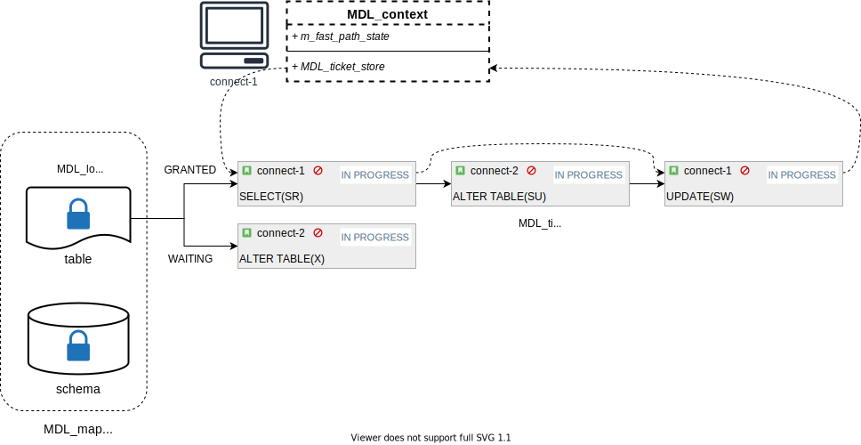

# 背景

为了满足数据库在并发请求下的事务隔离性和一致性要求，同时针对 MySQL 插件式多种存储引擎都能发挥作用，MySQL 在 Server 层实现了 Metadata Locking（MDL）机制。达到的效果比如可以在事务访问数据库的某种资源时，限制其他并发事务删除该资源。这是一种逻辑意义上的锁，与操作系统内核提供的有限种类 mutex 不同，MDL 可以灵活自定义锁的对象、锁的类型以及不同锁类型的优先级，甚至可以做到在系统不同状态时动态调整不同锁类型的兼容性，极大的方便了数据库对各种查询请求进行合理的并发控制。

本文将介绍在 MDL 系统中常用的数据结构及含义，然后从实现角度讨论 MDL 的获取机制与死锁检测，最后分享在实践中如何监控 MDL 状态。

# 基本概念

## MDL_key

MDL 的对象是采用键值对（key-value）的方式描述的，每一个 key 值都唯一的代表了锁的对象（value 代表数据库的某种资源）。key 是由 MDL_key 表示的，用字符串的形式表示了对象的名称。


完整的字符串由 namespace、按层次每一级的名称组成，多种命名空间可以将不同类型的同名对象区分开。命名空间包括 GLOBAL、SCHEMA、TABLE、FUNCTION、PROCEDURE 等数据库中可以创建的不同对象类型组成。

对象的名称根据类型的不同可以由多种层次组成。比如表对象就由数据库名和表名唯一的描述；如果是 SCHEMA 对象，那就只有数据库名这一个层次。名称之间用字符串结束符 '\0' 分隔。因此由这几部分组成的字符串整体就能作为 key 唯一的表示数据库的某种对象。

## enum_mdl_type

对于同一个数据库对象而言，不同的查询也有着不同的访问模式，比如 SELECT 语句是想要读取对象的内容，INSERT / UPDATE 语句是想要修改对象的内容，DDL 语句是想要修改对象的结构和定义。这些语句对于对象的影响程度和并发隔离性的要求不同，因此 MySQL 定义了不同类型的 MDL 以及他们之间的兼容性来控制这些语句的并发访问。

MDL 的类型由 enum_mdl_type 表示，最常用的类型包括:
- MDL_SHARED(S)，可以共享访问对象的元数据，比如 SHOW CREATE TABLE 语句
- MDL_SHARED_READ(SR)，可以共享访问对象的数据，比如 SELECT 语句
- MDL_SHARED_WRITE(SW)，可以修改对象的数据，比如 INSERT / UPDATE 语句
- MDL_SHARED_UPGRADABLE(SU)，可升级的共享锁，后面可升级到更强的锁（比如 X 锁，阻塞并发访问），比如 DDL 的第一阶段
- MDL_EXCLUSIVE(X)，独占锁，阻塞其他线程对该对象的并发访问，可以修改对象的元数据，比如 DDL 的第二阶段

不同的查询语句通过请求不同类型的 MDL，结合不同类型的 MDL 之间灵活定制的兼容性，就可以对相互冲突的语句进行并发控制。对于同一对象而言，不同类型的 MDL 之间的默认兼容性如下所述。

### 不同类型的 MDL 兼容性

MySQL 将锁类型划分为范围锁和对象锁。

#### 范围锁

范围锁种类较少（IX、S、X），主要用于 GLOBAL、COMMIT、TABLESPACE、BACKUP_LOCK 和 SCHEMA 命名空间的对象。这几种类型的兼容性简单，主要是从整体上去限制并发操作，比如全局的读锁来阻塞事务提交、DDL 更新表对象的元信息通过请求 SCHEMA 范围的意向独占锁（IX）来阻塞 SCHEMA 层面的修改操作。

这几种类型的 MDL 兼容性关系由两个矩阵定义。对于同一个对象来说，一个是已经获取到的 MDL 类型对新请求类型的兼容性情况；另一个是未获取到，正在等待的 MDL 请求类型对新请求类型的兼容性。由于 IS(INTENTION_SHARE) 在所有情况下与其他锁都兼容，在 MDL 系统中可忽略。

```shell
                 | Type of active   |
         Request |   scoped lock    |
          type   | IS(*)  IX   S  X |
        ---------+------------------+
        IS       |  +      +   +  + |
        IX       |  +      +   -  - |
        S        |  +      -   +  - |
        X        |  +      -   -  - |

                 |    Pending      |
         Request |  scoped lock    |
          type   | IS(*)  IX  S  X |
        ---------+-----------------+
        IS       |  +      +  +  + |
        IX       |  +      +  -  - |
        S        |  +      +  +  - |
        X        |  +      +  +  + |

        Here: "+" -- means that request can be satisfied
              "-" -- means that request can't be satisfied and should wait
```

#### 对象锁

对象锁包含的 MDL 类型比较丰富，应用于数据库绝大多数的基本对象。它们的兼容性矩阵如下：

```shell
         Request  |  Granted requests for lock            |
          type    | S  SH  SR  SW  SWLP  SU  SRO  SNW  SNRW  X  |
        ----------+---------------------------------------------+
        S         | +   +   +   +    +    +   +    +    +    -  |
        SH        | +   +   +   +    +    +   +    +    +    -  |
        SR        | +   +   +   +    +    +   +    +    -    -  |
        SW        | +   +   +   +    +    +   -    -    -    -  |
        SWLP      | +   +   +   +    +    +   -    -    -    -  |
        SU        | +   +   +   +    +    -   +    -    -    -  |
        SRO       | +   +   +   -    -    +   +    +    -    -  |
        SNW       | +   +   +   -    -    -   +    -    -    -  |
        SNRW      | +   +   -   -    -    -   -    -    -    -  |
        X         | -   -   -   -    -    -   -    -    -    -  |

         Request  |         Pending requests for lock          |
          type    | S  SH  SR  SW  SWLP  SU  SRO  SNW  SNRW  X |
        ----------+--------------------------------------------+
        S         | +   +   +   +    +    +   +    +     +   - |
        SH        | +   +   +   +    +    +   +    +     +   + |
        SR        | +   +   +   +    +    +   +    +     -   - |
        SW        | +   +   +   +    +    +   +    -     -   - |
        SWLP      | +   +   +   +    +    +   -    -     -   - |
        SU        | +   +   +   +    +    +   +    +     +   - |
        SRO       | +   +   +   -    +    +   +    +     -   - |
        SNW       | +   +   +   +    +    +   +    +     +   - |
        SNRW      | +   +   +   +    +    +   +    +     +   - |
        X         | +   +   +   +    +    +   +    +     +   + |

        Here: "+" -- means that request can be satisfied
              "-" -- means that request can't be satisfied and should wait
```

在 MDL 获取过程中，通过这两个兼容性矩阵，就可以判断当前是否存在与请求的 MDL 不兼容的 granted / pending 状态的 MDL，来决定该请求是否能被满足，如果不能被满足则进入 pending 等待状态。

MDL 系统也通过兼容性矩阵来判断锁类型的强弱，方法如下：

```c++
/**
  Check if ticket represents metadata lock of "stronger" or equal type
  than specified one. I.e. if metadata lock represented by ticket won't
  allow any of locks which are not allowed by specified type of lock.

  @return true  if ticket has stronger or equal type
          false otherwise.
*/
bool MDL_ticket::has_stronger_or_equal_type(enum_mdl_type type) const {
  const MDL_lock::bitmap_t *granted_incompat_map =
      m_lock->incompatible_granted_types_bitmap();

  return !(granted_incompat_map[type] & ~(granted_incompat_map[m_type]));
}
```

表达式的写法有点绕，可以理解为，如果 type 类型与某种 m_type 类型兼容的 MDL 不兼容，那么 type 类型更强；否则 m_type 类型相同或更强。或者较弱的类型不兼容的 MDL 类型，较强的 MDL 都不兼容。

# 重要数据结构

## 关系示意图



## MDL_request

代表着语句对 MDL 的请求，由 MDL_key 、enum_mdl_type 和 enum_mdl_duration 组成，MDL_key 和 enum_mdl_type 确定了 MDL 的对象和锁类型。

enum_mdl_duration 有三种类型，表示 MDL 的持有周期，有单条语句级的周期、事务级别的、和显式周期。

MDL_request 的生命周期是在 MDL 系统之外，由用户控制的，可以是一个临时变量。但是通过该请求获取到的 MDL 生命周期是持久的，由 MDL 系统控制，并不会随着 MDL_request 的销毁而释放。

## MDL_lock

对于数据库的某一对象，仅有一个与其名字（MDL_key）对应的锁对象 MDL_lock 存在。当数据库的对象在初次被访问时，由 lock-free HASH 在其内存中创建和管理 MDL_lock；当后续访问到来时，对于相同对象的访问会引用到同一个 MDL_lock。

MDL_lock 中既有当前正在等待该锁对象的 m_waiting 队列，也有该对象已经授予的 m_granted 队列，队列中的元素用 MDL_ticket 表示。

使用静态 bitmap 对象组成的 MDL_lock_strategy 来存放上述范围锁和对象锁的兼容性矩阵，根据 MDL_lock 的命名空间就可以获取到该锁的兼容性情况。

## MDL_ticket

MDL_lock 与 enum_mdl_type 共同组成了 MDL_ticket，代表着当前线程对数据库对象的访问权限。MDL_ticket 在每个查询请求 MDL 锁时创建，内存由 MDL 系统分配，在事务结束时摧毁。

MDL_ticket 中包含两组指针分别将该线程获取到的所有 ticket 连接起来和将该 ticket 参与的锁对象的 waiting 状态或者 granted 状态的 ticket 连接起来。

## MDL_context

一个线程获取 MDL 锁的上下文，每个连接都对应一个，包含了该连接获取到的所有 MDL_ticket。按照不同的生命周期存放在各自的链表中，由 MDL_ticket_store 管理。

一个连接获得的所有锁根据生命周期可以划分为三种：语句级，事务级和显式锁。语句级和事务级的锁都是有着自动的生命周期和作用范围，他们在一个事务过程中进行积累。语句级的锁在最外层的语句结束后自动释放，事务级的锁在COMMIT、ROLLBACK 和 ROLLBACK TO SAVEPOINT 之后释放，他们不会被手动释放。具有显式生命周期的ticket 是为了跨事务和 checkpoint 的锁所获取的，包括 HANDLER SQL locks、LOCK TABLES locks 和用户级的锁 GET_LOCK()/RELEASE_LOCK()。语句级和事务级的锁会按照时间顺序的反序被加到对应链表的前面，当我们回滚到某一检查点时，就会从链表的前面将对应的 ticket 释放出栈，直到检查点创建前最后一个获取到的 ticket。

当一个线程想要获取某个 MDL 锁时，会优先在自己的 MDL_ticket_store 中查找是否在事务内已经获取到相同锁对象更强类型的 MDL_ticket。因此 MDL_ticket_store 会提供根据 MDL_request 请求查找 MDL_ticket 的接口，一种是在不同生命周期的 MDL_ticket 链表中查找；如果当前线程获取的 MDL_ticket 数量超过阈值（默认256），会将所有的 MDL_ticket 维护在额外的 std::unordered_multimap 中，来加速查找。

```c++
MDL_ticket_store::MDL_ticket_handle MDL_ticket_store::find(
    const MDL_request &req) const {
#ifndef DBUG_OFF
  if (m_count >= THRESHOLD) {
    MDL_ticket_handle list_h = find_in_lists(req);
    MDL_ticket_handle hash_h = find_in_hash(req);

    DBUG_ASSERT(equivalent(list_h.m_ticket, hash_h.m_ticket, req.duration));
  }
#endif /*! DBUG_OFF */
  return (m_map == nullptr || m_count < THRESHOLD) ? find_in_lists(req)
                                                   : find_in_hash(req);
}
```

# MDL 获取过程

几乎所有的查询语句（包括 DML 和 DDL 第一阶段）都是在 parse 阶段，由 LEX 和 YACC 根据语句的类型给需要访问的表初始化 MDL 锁请求，比如 SELECT 语句就是 SR，INSERT 语句就是 SW，ALTER TABLE 语句就是 SU。这个过程在以下调用栈中：

```c++
PT_table_factor_table_ident::contextualize()
  |--SELECT_LEX::add_table_to_list()
    |--MDL_REQUEST_INIT -> MDL_request::init_with_source()
```

语句在执行前会首先通过 open_tables_for_query 函数将所有需要访问的表打开，获得 TABLE 表对象。在这个过程中会先获取 MDL 锁，然后才获取表资源，防止对同一个表的元信息出现并发读写。对 MDL 锁的请求都是由当前线程的上下文 MDL_context 调用 MDL_context::acquire_lock 进行的，调用栈如下：

```c++
open_tables_for_query()
  |--open_table() // 循环打开每一个表
    |--open_table_get_mdl_lock()
      |--MDL_context::acquire_lock() // 获取lock，如果遇到锁冲突，那么等待冲突的锁被释放
        |--MDL_context::try_acquire_lock_impl()
```

## MDL_context::try_acquire_lock_impl

接下来我们重点看一下 MDL_context::try_acquire_lock_impl 的过程。这个函数包含了各种类型锁（兼容性好的，兼容性差的）的获取以及锁冲突检测，传入参数是当前的 MDL_request，输出参数为获取到的 MDL_ticket。

首先会根据 MDL_request 在当前线程已持有的相同对象 MDL_ticket 中查找类型更强、生命周期相同或不同的 ticket。如果已经持有相同生命周期的，那么直接返回；持有不同生命周期的，根据 ticket 克隆出一个相同周期的返回即可。

我们在前面提到了根据锁类型的兼容性情况，可以划分为 unobtrusive 和 obtrusive 的锁，在锁获取过程中也分别对应 fast path 和 slow path，代表获取的难易度不同。

### Unobtrusive(fast path)

对于一些弱类型（unobtrusive，例如 SR/SW 等）的 MDL 请求，由于这部分的请求占绝大多数，且兼容性较好，获取后不用记录下是哪个具体的 MDL_ticket，只需要记录有多少请求已获取。因此在 MDL_lock 中使用整型原子变量 std::atomic<fast_path_state_t> m_fast_path_state 来统计该锁授予的所有 unobtrusive 的锁类型数量，每种 unobtrusive 的锁有不同的数值表示，留下固定的 bit 范围存放该种锁类型累加后的结果，相当于用一个 longlong 类型统计了所有 unobtrusive 锁的授予个数，同时可以通过 CAS 无锁修改。另外在 m_fast_path_state 的高位 bit，还存在三个状态指示位，分别是 IS_DESTROYED/HAS_OBTRUSIVE/HAS_SLOW_PATH。

```c++
/**
   Array of increments for "unobtrusive" types of lock requests for
   per-object locks.

   @sa MDL_lock::get_unobtrusive_lock_increment().

   For per-object locks:
   - "unobtrusive" types: S, SH, SR and SW
   - "obtrusive" types: SU, SRO, SNW, SNRW, X

   Number of locks acquired using "fast path" are encoded in the following
   bits of MDL_lock::m_fast_path_state:

   - bits 0 .. 19  - S and SH (we don't differentiate them once acquired)
   - bits 20 .. 39 - SR
   - bits 40 .. 59 - SW and SWLP (we don't differentiate them once acquired)

   Overflow is not an issue as we are unlikely to support more than 2^20 - 1
   concurrent connections in foreseeable future.

   This encoding defines the below contents of increment array.
*/
{0, 1, 1, 1ULL << 20, 1ULL << 40, 1ULL << 40, 0, 0, 0, 0, 0},
```

根据 MDL_request 的请求类型，获取对应类型的 unobtrusive 整型递增值，如果递增值为 0，则代表是 obtrusive 的锁，需要走 slow path。 

```c++
/**
  @returns "Fast path" increment for request for "unobtrusive" type
            of lock, 0 - if it is request for "obtrusive" type of
            lock.

  @sa Description at method declaration for more details.
*/
MDL_lock::fast_path_state_t MDL_lock::get_unobtrusive_lock_increment(
    const MDL_request *request) {
  return MDL_lock::get_strategy(request->key)
      ->m_unobtrusive_lock_increment[request->type];
}
```

如果非 0，代表着该类型锁是 unobtrusive，就会走 fast path，直接通过 CAS 来给 MDL_lock::m_fast_path_state 递增上对应的整型值即可。但是需要确认一个条件，就是该对象没有被其他线程以 obtrusive 的方式锁住，因为 unobtrusive 和 obtrusive 的锁类型有些是互斥的，只有在没有 obtrusive 的锁存在时，其他的 unobtrusive 锁彼此兼容，才可以不用判断其他线程的锁持有情况直接获取。

```c++
MDL_lock::fast_path_state_t old_state = lock->m_fast_path_state;

do {
  /*
    Check if hash look-up returned object marked as destroyed or
    it was marked as such while it was pinned by us. If yes we
    need to unpin it and retry look-up.
  */
  if (old_state & MDL_lock::IS_DESTROYED) {
    if (pinned) lf_hash_search_unpin(m_pins);
    goto retry;
  }

  /*
    Check that there are no granted/pending "obtrusive" locks and nobody
    even is about to try to check if such lock can be acquired.

    In these cases we need to take "slow path".
  */
  if (old_state & MDL_lock::HAS_OBTRUSIVE) goto slow_path;

  } while (!lock->fast_path_state_cas(
      &old_state, old_state + unobtrusive_lock_increment));
```

CAS 完成后，设置相关数据结构的状态和引用，将当前 MDL_ticket 加入到线程的 MDL_ticket_store 中即可返回：

```c++
/*
  Since this MDL_ticket is not visible to any threads other than
  the current one, we can set MDL_ticket::m_lock member without
  protect of MDL_lock::m_rwlock. MDL_lock won't be deleted
  underneath our feet as MDL_lock::m_fast_path_state serves as
  reference counter in this case.
*/
ticket->m_lock = lock;
ticket->m_is_fast_path = true;
m_ticket_store.push_front(mdl_request->duration, ticket);
mdl_request->ticket = ticket;

mysql_mdl_set_status(ticket->m_psi, MDL_ticket::GRANTED);
```

### Obtrusive(slow path)

对于一些比较强类型（obtrusive，例如 SU/SRO/X 等）的 MDL 请求，会在对应 MDL_lock 的 m_granted 链表中存放对应的 MDL_ticket。因此在获取时也需要遍历这个链表和其他的 bitmap 来判断与其他线程已获取或者正在等待的 MDL_ticket 是否存在锁冲突。

需要走 slow path 获取锁之前，当前线程需要将 MDL_lock::m_fast_path_state 中由当前线程之前通过 fast path 获取到的锁物化，从 bitmap 中移出，加入到 MDL_lock::m_granted 中。因为在 MDL_lock::m_fast_path_state 中包含的 bitmap 是无法区分线程的，而当前线程获取的多个锁之间是不构成锁冲突的，所以在通过 bitmap 判断前，需要确保 MDL_lock::m_fast_path_state 的 ticket 都是属于其他线程的。

```c++
/**
  "Materialize" requests for locks which were satisfied using
  "fast path" by properly including them into corresponding
  MDL_lock::m_granted bitmaps/lists and removing it from
  packed counter in MDL_lock::m_fast_path_state.
*/
void MDL_context::materialize_fast_path_locks() {
  int i;

  for (i = 0; i < MDL_DURATION_END; i++) {
    MDL_ticket_store::List_iterator it = m_ticket_store.list_iterator(i);

    MDL_ticket *matf = m_ticket_store.materialized_front(i);
    for (MDL_ticket *ticket = it++; ticket != matf; ticket = it++) {
      if (ticket->m_is_fast_path) {
        MDL_lock *lock = ticket->m_lock;
        MDL_lock::fast_path_state_t unobtrusive_lock_increment =
            lock->get_unobtrusive_lock_increment(ticket->get_type());
        ticket->m_is_fast_path = false;
        mysql_prlock_wrlock(&lock->m_rwlock);
        lock->m_granted.add_ticket(ticket);
        /*
          Atomically decrement counter in MDL_lock::m_fast_path_state.
          This needs to happen under protection of MDL_lock::m_rwlock to make
          it atomic with addition of ticket to MDL_lock::m_granted list and
          to enforce invariant [INV1].
        */
        MDL_lock::fast_path_state_t old_state = lock->m_fast_path_state;
        while (!lock->fast_path_state_cas(
            &old_state, ((old_state - unobtrusive_lock_increment) |
                         MDL_lock::HAS_SLOW_PATH))) {
        }
        mysql_prlock_unlock(&lock->m_rwlock);
      }
    }
  }
  m_ticket_store.set_materialized();
}
```

在物化完成后，就可以通过当前锁正在等待的 ticket 类型（m_waiting）、已经授予的 ticket 类型（m_granted）和 unobtrusive 的锁类型状态（MDL_lock::m_fast_path_state），结合前面的兼容性矩阵来判断当前请求的锁类型是否能获取到，这个过程主要在 MDL_lock::can_grant_lock 中。

```c++
bool MDL_lock::can_grant_lock(enum_mdl_type type_arg,
                              const MDL_context *requestor_ctx) const {
  bool can_grant = false;
  bitmap_t waiting_incompat_map = incompatible_waiting_types_bitmap()[type_arg];
  bitmap_t granted_incompat_map = incompatible_granted_types_bitmap()[type_arg];

  /*
    New lock request can be satisfied iff:
    - There are no incompatible types of satisfied requests
    in other contexts
    - There are no waiting requests which have higher priority
    than this request.
  */
  if (!(m_waiting.bitmap() & waiting_incompat_map)) {
    if (!(fast_path_granted_bitmap() & granted_incompat_map)) {
      if (!(m_granted.bitmap() & granted_incompat_map))
        can_grant = true;
      else {
        Ticket_iterator it(m_granted);
        MDL_ticket *ticket;

        /*
          There is an incompatible lock. Check that it belongs to some
          other context.
        */
        while ((ticket = it++)) {
          if (ticket->get_ctx() != requestor_ctx &&
              ticket->is_incompatible_when_granted(type_arg))
            break;
        }
        if (ticket == NULL) /* Incompatible locks are our own. */
          can_grant = true;
      }
    }
  }
  return can_grant;
}
```

在 m_waiting 和 m_granted 中，除了有链表将 ticket 连接起来，也会用 bitmap 收集链表中所有 ticket 的类型，方便直接进行比较。在 m_granted 中发现不兼容类型后，还需要遍历链表，判断不兼容类型的 ticket 是不是当前线程获取的，只有是非当前线程获取的情况下，才出现锁冲突。unobtrusive 的锁如果能获取的话，会直接加入到 MDL_lock::m_granted 链表中。

## 锁等待和通知

上述过程中，如果能顺利获取到 MDL_ticket，就完成了 MDL 的获取，可以继续查询过程。如果无法获取到（不管是 unobtrusive 的锁由于 obtrusive 的锁存在而被迫走 slow path，还是本身 obtrusive 的锁无法获取），就需要进行锁等待，锁等待的过程是不区分是否为 unobtrusive 还是 obtrusive 的，统一进行处理。

每个线程的 MDL_context 中包含一个 MDL_wait 成员，因为锁等待以及死锁检测都是以线程为对象，通过将对应请求的 MDL_ticket 加入到锁等待者队列中来订阅通知。有一组 mutex、condition variable 和枚举状态用来完成线程间的等待、通知。等待的状态包括五种：

```c++
// WS_EMPTY since EMPTY conflicts with #define in system headers on some
// platforms.
enum enum_wait_status { WS_EMPTY = 0, GRANTED, VICTIM, TIMEOUT, KILLED };
```

WS_EMPTY 为初始状态，其他的都是等待的结果状态，从命令可以看出，等待的结果分别可能是：
- GRANTED，该线程获取到了等待的 MDL 锁
- VICTIM，该线程作为死锁的受害者，要求重新执行事务
- TIMEOUT，等待超时
- KILLED，该线程在等待过程中被 kill 掉

等待的线程首先将自己想要获取的 ticket 加入到 MDL_lock 的 m_waiting 队列，然后根据配置的等待时间调用 MDL_wait 的函数进行超时等待：

```c++
/**
  Wait for the status to be assigned to this wait slot.
*/
MDL_wait::enum_wait_status MDL_wait::timed_wait(
    MDL_context_owner *owner, struct timespec *abs_timeout,
    bool set_status_on_timeout, const PSI_stage_info *wait_state_name) {
  enum_wait_status result;
  int wait_result = 0;

  mysql_mutex_lock(&m_LOCK_wait_status);

  while (!m_wait_status && !owner->is_killed() && !is_timeout(wait_result)) {
    wait_result = mysql_cond_timedwait(&m_COND_wait_status, &m_LOCK_wait_status,
                                       abs_timeout);
  }

  if (m_wait_status == WS_EMPTY) {
    if (owner->is_killed())
      m_wait_status = KILLED;
    else if (set_status_on_timeout)
      m_wait_status = TIMEOUT;
  }
  result = m_wait_status;

  mysql_mutex_unlock(&m_LOCK_wait_status);

  return result;
}
```

当其他持有不兼容类型锁的线程查询完成或者事务结束时，会一块释放持有的所有锁，同时根据是否是 fast path 还是 slow path 路径获取到的，恢复 MDL_lock::m_fast_path_state 的状态和 MDL_lock::m_granted 链表。除此之外，如果 MDL_lock::m_waiting 存在正在等待的 ticket，就会调用 MDL_lock::reschedule_waiters() 来唤醒可以获取到锁的线程，并设置等待状态为 GRANTED：

```c++
void MDL_lock::reschedule_waiters() {
  MDL_lock::Ticket_iterator it(m_waiting);
  MDL_ticket *ticket;

  while ((ticket = it++)) {
    if (can_grant_lock(ticket->get_type(), ticket->get_ctx())) {
      if (!ticket->get_ctx()->m_wait.set_status(MDL_wait::GRANTED)) {
        m_waiting.remove_ticket(ticket);
        m_granted.add_ticket(ticket);
 ...
```

```c++
/**
  Set the status unless it's already set. Return false if set,
  true otherwise.
*/
bool MDL_wait::set_status(enum_wait_status status_arg) {
  bool was_occupied = true;
  mysql_mutex_lock(&m_LOCK_wait_status);
  if (m_wait_status == WS_EMPTY) {
    was_occupied = false;
    m_wait_status = status_arg;
    mysql_cond_signal(&m_COND_wait_status);
  }
  mysql_mutex_unlock(&m_LOCK_wait_status);
  return was_occupied;
}
```

被唤醒的等待线程，如果发现 ticket 是 GRANTED 状态，就会继续执行；否则根据不同情况报错。

## 死锁检测

每个线程在进入锁等待之前，都会进行一次死锁检测，避免当前线程陷入死等。在检测死锁前，首先将当前线程所获取到的 unobtrusive 锁物化，这样这些锁才会出现在 MDL_lock::m_granted 链表中，死锁检测才有可能探测到。并且设置当前线程的等待锁 MDL_context::m_waiting_for 为当前的 ticket，每个进入等待的线程都会设置等待对象，沿着这条等待链就可以检测死锁。

```c++
/** Inform the deadlock detector there is an edge in the wait-for graph. */
void will_wait_for(MDL_wait_for_subgraph *waiting_for_arg) {
  /*
    Before starting wait for any resource we need to materialize
    all "fast path" tickets belonging to this thread. Otherwise
    locks acquired which are represented by these tickets won't
    be present in wait-for graph and could cause missed deadlocks.

    It is OK for context which doesn't wait for any resource to
    have "fast path" tickets, as such context can't participate
    in any deadlock.
  */
  materialize_fast_path_locks();

  mysql_prlock_wrlock(&m_LOCK_waiting_for);
  m_waiting_for = waiting_for_arg;
  mysql_prlock_unlock(&m_LOCK_waiting_for);
}
```

### MDL_wait_for_subgraph

代表等待图中一条边的抽象类，会由死锁检测算法进行遍历。MDL_ticket 派生于 MDL_wait_for_subgraph，通过实现 accept_visitor() 函数来让辅助检测类顺着边寻找等待环。

### Deadlock_detection_visitor

在等待图中检测等待环的辅助类，包含检测过程中的状态信息，比如死锁检测的起始线程 m_start_node；在搜索过程中发生死锁后，根据权重选择的受害者线程 m_victim；搜索的线程深度，假如线程的等待链过长，超过了阈值（默认32），即使没检测到死锁也认为死锁发生。

实现 enter_node() 和 leave_node() 函数来进入下一线程节点和退出，通过 inspect_edge() 来发现是否当前线程节点已经是起始节点从而判断成环。通过 opt_change_victim_to() 来比较受害者的死锁权重来决定受害者。

```c++
/**
  Inspect a wait-for graph edge from one MDL context to another.

  @retval true   A loop is found.
  @retval false  No loop is found.
*/
bool Deadlock_detection_visitor::inspect_edge(MDL_context *node) {
  m_found_deadlock = node == m_start_node;
  return m_found_deadlock;
}

/**
  Change the deadlock victim to a new one if it has lower deadlock
  weight.

  @param new_victim New candidate for deadlock victim.
*/
void Deadlock_detection_visitor::opt_change_victim_to(MDL_context *new_victim) {
  if (m_victim == NULL ||
      m_victim->get_deadlock_weight() >= new_victim->get_deadlock_weight()) {
    /* Swap victims, unlock the old one. */
    MDL_context *tmp = m_victim;
    m_victim = new_victim;
    m_victim->lock_deadlock_victim();
    if (tmp) tmp->unlock_deadlock_victim();
  }
}
```

### 检测过程

死锁检测的思路是，首先广度优先，从当前线程等待的锁出发，遍历 MDL_lock 的等待队列和授予队列，看看是否有非当前线程获取的、与等待的锁不兼容的锁存在，如果这个持有线程与算法遍历的起点线程相同，那么锁等待链存在死锁；其次深度优先，从不兼容的锁的持有或等待线程出发，如果该线程也处于等待状态，那么递归重复前述过程，直到找到等待起点线程，否则判断不存在死锁。代码逻辑如下：

```c++
MDL_context::find_deadlock()
  |--MDL_context::visit_subgraph(MDL_wait_for_graph_visitor *) // 如果存在m_waiting_for的话，调用对应ticket的accept_visitor()
    |--MDL_ticket::accept_visitor(MDL_wait_for_graph_visitor *) // 根据对应MDL_lock的锁获取情况检测
      |--MDL_lock::visit_subgraph() // 递归遍历锁的授予链表(m_granted)和等待链表(m_waiting)去判断是否存在等待起始节点(死锁)情况
         // 依次递归授予链表和等待链表的MDL_context来寻找死锁
        |--Deadlock_detection_visitor::enter_node() // 首先进入当前节点
        |--遍历授予链表(m_granted)，判断兼容性
          |--如果不兼容的话，调用Deadlock_detection_visitor::inspect_edge()判断是否死锁
        |--遍历等待链表(m_waiting)，同上
        |--遍历授予链表，判断兼容性
          |--如果不兼容的话，递归调用MDL_context::visit_subgraph()寻找连通子图。如果线程等待的ticket已经有明确的状态，非WS_EMPTY，可以直接返回
        |--遍历等待链表，同上
        |--Deadlock_detection_visitor::leave_node() // 离开当前节点
```

```c++
/*
  We do a breadth-first search first -- that is, inspect all
  edges of the current node, and only then follow up to the next
  node. In workloads that involve wait-for graph loops this
  has proven to be a more efficient strategy [citation missing].
*/
while ((ticket = granted_it++)) {
  /* Filter out edges that point to the same node. */
  if (ticket->get_ctx() != src_ctx &&
      ticket->is_incompatible_when_granted(waiting_ticket->get_type()) &&
      gvisitor->inspect_edge(ticket->get_ctx())) {
    goto end_leave_node;
  }
}
...
/* Recurse and inspect all adjacent nodes. */
granted_it.rewind();
while ((ticket = granted_it++)) {
  if (ticket->get_ctx() != src_ctx &&
      ticket->is_incompatible_when_granted(waiting_ticket->get_type()) &&
      ticket->get_ctx()->visit_subgraph(gvisitor)) {
    goto end_leave_node;
  }
}
...
```

### 受害者权重

在检测到死锁后，沿着线程等待链退出的时候，会根据每个线程等待 ticket 的权重，选择权重最小的作为受害者，让其放弃等待并释放持有的锁，在 Deadlock_detection_visitor::opt_change_victim_to 函数中。

在权重方面做的还是比较粗糙的，并不考虑事务进行的阶段，以及执行的语句内容，仅仅是根据锁资源的类型和锁种类有一个预设的权重，在 MDL_ticket::get_deadlock_weight() 函数中。
● DEADLOCK_WEIGHT_DML，DML 类型语句的权重最小为 0
● DEADLOCK_WEIGHT_ULL，用户手动上锁的权重居中为 50
● DEADLOCK_WEIGHT_DDL，DDL 类型语句的权重最大为 100

由此可见，在发生死锁时更偏向于让 DML 语句报错回滚，让 DDL 语句继续执行。当同类型语句构成死锁时，更偏向让后进入等待链的线程成为受害者，让等待的比较久的线程继续等待。

当前线程将死锁环上受害者线程的状态设置为 VICTIM 并唤醒后，当前线程即可进入等待状态。

# MDL 监控

通过 MySQL performance_schema 可以清晰的监控当前 MDL 锁的获取情况，performance_schema 是一个只读变量，设置需重启，在配置文件中添加：

```shell
[mysqld]
performance_schema = ON
```

通过 performance_schema.setup_instruments 表设置 MDL 监控项：

```sql
UPDATE performance_schema.setup_instruments
SET ENABLED = 'YES', TIMED = 'YES'
WHERE NAME = 'wait/lock/metadata/sql/mdl';
```

之后我们就可以访问 performance_schema.metadata_locks 表来监控 MDL 获取情况，比如有两个线程处于以下状态：

```sql
connect-1 > BEGIN;                    |
Query OK, 0 rows affected (0.00 sec)  |
                                      |
connect-1 > SELECT * FROM t1;         |
+------+------+------+                |
| a    | b    | c    |                |       
+------+------+------+                |
|    1 |    2 |    3 |                |
|    4 |    5 |    6 |                |
+------+------+------+                |
2 rows in set (0.00 sec)              | # DDL will hang
                                      | connect-2 > ALTER TABLE t1 ADD INDEX i1(a);
```

线程1事务没提交，导致线程2做 DDL hang 住，访问 performance_schema.metadata_locks 可以看到是因为线程1持有 t1 的 SHARED_READ 锁，导致需要获取 EXCLUSIVE 锁的线程2处于等待状态。

```sql
mysql > SELECT * FROM performance_schema.metadata_locks;
+-------------+--------------------+----------------+-------------+-----------------------+---------------------+---------------+-------------+--------------------+-----------------+----------------+
| OBJECT_TYPE | OBJECT_SCHEMA      | OBJECT_NAME    | COLUMN_NAME | OBJECT_INSTANCE_BEGIN | LOCK_TYPE           | LOCK_DURATION | LOCK_STATUS | SOURCE             | OWNER_THREAD_ID | OWNER_EVENT_ID |
+-------------+--------------------+----------------+-------------+-----------------------+---------------------+---------------+-------------+--------------------+-----------------+----------------+
| TABLE       | test               | t1             | NULL        |       140734873224192 | SHARED_READ         | TRANSACTION   | GRANTED     | sql_parse.cc:6759  |              68 |             23 |
| GLOBAL      | NULL               | NULL           | NULL        |       140734862726080 | INTENTION_EXCLUSIVE | STATEMENT     | GRANTED     | sql_base.cc:6137   |              69 |              6 |
| SCHEMA      | test               | NULL           | NULL        |       140734862726240 | INTENTION_EXCLUSIVE | TRANSACTION   | GRANTED     | sql_base.cc:6124   |              69 |              6 |
| TABLE       | test               | t1             | NULL        |       140734862726400 | SHARED_UPGRADABLE   | TRANSACTION   | GRANTED     | sql_parse.cc:6759  |              69 |              6 |
| BACKUP LOCK | NULL               | NULL           | NULL        |       140734862726560 | INTENTION_EXCLUSIVE | TRANSACTION   | GRANTED     | sql_base.cc:6144   |              69 |              6 |
| TABLESPACE  | NULL               | test/t1        | NULL        |       140734862727040 | INTENTION_EXCLUSIVE | TRANSACTION   | GRANTED     | lock.cc:811        |              69 |              6 |
| TABLE       | test               | #sql-5a52_a    | NULL        |       140734862726720 | EXCLUSIVE           | STATEMENT     | GRANTED     | sql_table.cc:17089 |              69 |              6 |
| TABLE       | test               | t1             | NULL        |       140734862726880 | EXCLUSIVE           | TRANSACTION   | PENDING     | mdl.cc:4337        |              69 |              6 |
| TABLE       | performance_schema | metadata_locks | NULL        |       140734887891904 | SHARED_READ         | TRANSACTION   | GRANTED     | sql_parse.cc:6759  |              67 |              4 |
+-------------+--------------------+----------------+-------------+-----------------------+---------------------+---------------+-------------+--------------------+-----------------+----------------+
9 rows in set (0.00 sec)
```

通过 SHOW PROCESSLIST 命令也可以看到线程2查询执行状态：

```sql
mysql > SHOW PROCESSLIST;
+----+-----------------+-----------+------+---------+------+---------------------------------+--------------------------------+
| Id | User            | Host      | db   | Command | Time | State                           | Info                           |
+----+-----------------+-----------+------+---------+------+---------------------------------+--------------------------------+
|  4 | event_scheduler | localhost | NULL | Daemon  |  794 | Waiting on empty queue          | NULL                           |
|  8 | root            | localhost | NULL | Query   |    0 | starting                        | SHOW PROCESSLIST               |
|  9 | root            | localhost | test | Sleep   |  382 |                                 | NULL                           |
| 10 | root            | localhost | test | Query   |  289 | Waiting for table metadata lock | ALTER TABLE t1 ADD INDEX i1(a) |
+----+-----------------+-----------+------+---------+------+---------------------------------+--------------------------------+
4 rows in set (0.00 sec)
```

# 参考

[1] [Source code mysql / mysql-server 8.0.18](https://github.com/mysql/mysql-server/tree/mysql-8.0.18)

[2] [MySQL · 源码分析 · 常用SQL语句的MDL加锁源码分析](http://mysql.taobao.org/monthly/2018/02/01/)
