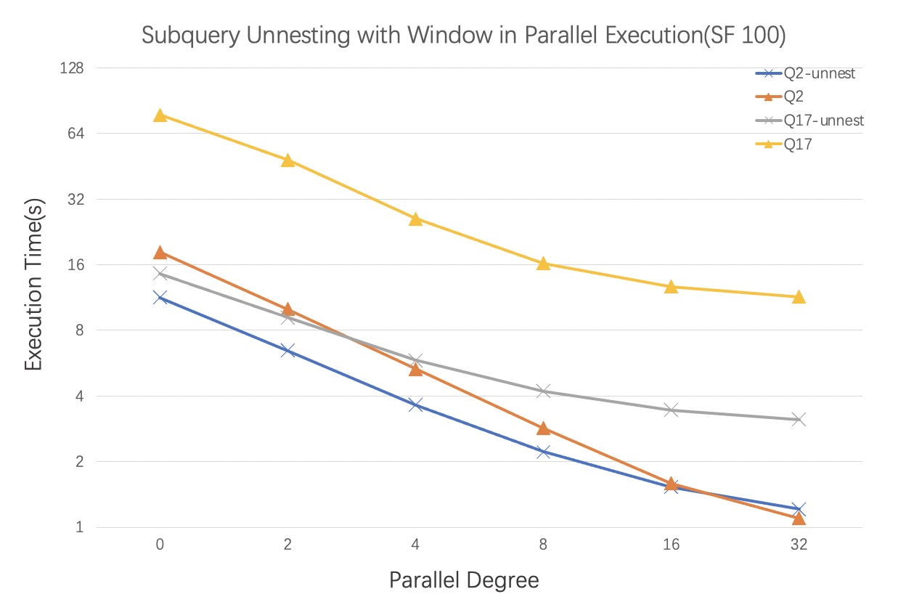

# 简介

关联子查询是大多数现代关系型数据库都支持的一类SQL，这种形式的SQL具有很强的语义表达能力，能够让用户在子查询中直接引用到外层查询中的列，来计算子查询的结果。关联子查询在决策支持系统和在线分析处理的场景中被广泛使用，例如在决策支持基准TPC-H的22个查询中，有1/3的查询都包含关联子查询。因此能够高效地执行关联子查询是衡量一个数据库是否先进的标准。

子查询解关联是数据库对关联子查询进行优化的一个重要手段。在没有解关联时，子查询是按照语义进行迭代式执行，即外层查询每查询到一条数据，子查询就会被触发一次执行，因此在整个查询完成时，关联子查询被执行了很多次。如果外层查询的数据较多，且子查询不能被高效执行，那么整个查询的效率将会十分低下。

本文介绍了一种方法，借助窗口聚合函数的能力来将子查询解关联，不仅使子查询仅需执行一次，而且避免了外层查询和子查询中相同公共表的多次访问，从两方面大大加速了整个查询。

笔者在MySQL中实现这种解关联方法属于业界首创，不仅在Benchmark方面大幅提升TPC-H Q2/Q17的性能，而且在线上默认开启，对符合条件的用户查询，都会带来稳定可保证的性能提升。MySQL业界专家[Øystein](https://www.blogger.com/profile/11287151295676613909)也曾发表博客[Use Window Functions to Speed Up Correlated Subqueries](https://oysteing.blogspot.com/2021/06/use-window-functions-to-speed-up.html)介绍过这一实现，就像他在博客中提到的：

> At Alibaba, we have implemented the query transformation to window functions in our Innovative Version of POLARDB for MySQL. Unlike the [subquery transformation introduced in MySQL 8.0.24](https://dev.mysql.com/worklog/task/?id=13520), which is off by default since it may often significantly reduce the query performance, our transformation can be applied automatically. As long as the query satisfies the conditions listed above, it should not be any slower than the original query. In other words, with POLARDB you will no longer have to manually rewrite your query to get the benefits discussed in this blog post.

# 关联子查询形式

一种常见的关联子查询形式，是在子查询中包含了聚合函数，外查询利用子查询聚合的结果做进一步运算。一个比较典型的例子是TPC-H中的Query 2：

```sql
SELECT s_acctbal, s_name, n_name, p_partkey, p_mfgr, 
 s_address, s_phone, s_comment
FROM part, supplier, partsupp, nation, region
WHERE p_partkey = ps_partkey
   AND s_suppkey = ps_suppkey
   AND p_size = 30
   AND p_type LIKE '%STEEL'
   AND s_nationkey = n_nationkey
   AND n_regionkey = r_regionkey
   AND r_name = 'ASIA'
   AND ps_supplycost = (
       SELECT MIN(ps_supplycost)
       FROM partsupp, supplier, nation, region
       WHERE p_partkey = ps_partkey
           AND s_suppkey = ps_suppkey
           AND s_nationkey = n_nationkey
           AND n_regionkey = r_regionkey
           AND r_name = 'ASIA'
   )
ORDER BY s_acctbal DESC, n_name, s_name, p_partkey
LIMIT 100;
```

该查询想要查找在特定区域，对于每一个有着特定类型和大小的零件，能够提供最小批发价的供应商。在以上写法中，主查询首先将符合条件的零件与对应的供应商及相关信息进行连接，对于每一条零件和供应商的组合，都通过关联子查询去计算对应零件所有供应商提供的最小批发价，然后比较当前组合是否与最小批发价相同，最后将批发价与最小值相同的供应商选出。

# 从语义上理解解关联过程

还是以上述查询举例说明，既然目的是查找每个零件提供最小批发价的供应商，除了上述这种迭代式方法，还可以提前将所有零件对应供应商的最小批发价计算出来，将结果存放下来，再与主查询零件和供应商的组合进行连接后比较，可以避免子查询的多次执行。

## 窗口聚合函数

窗口聚合函数是计算聚合结果的一种方式。相较于普通的聚合函数，窗口聚合函数的使用更加灵活，不会将数据聚拢，可以在不影响原本输出列的基础上，在每一行增加对应的聚合结果。其表达形式如下：

```sql
function(arg) OVER ([partition_clause] [order_clause] [frame_clause])
```

OVER语法定义了函数计算的窗口，其中partition_clause和我们通常使用到的GROUP BY语法相似，指明了聚合函数按照哪些列进行聚合。本文中仅涉及partition_clause语法的使用。

## 优化思路

### 第一步：引入窗口聚合函数，将关联子查询转换成非关联派生表

我们再观察上述查询的主查询体和子查询体，可以发现两者涉及的表、连接条件和过滤条件有诸多相似的地方：比如子查询中的表在外查询中都包含，这些表之间的连接条件与过滤条件在外查询中也包含。那么只看这些表，他们之间的连接结果在外查询和子查询中是完全一样的。既然窗口聚合函数可以在不影响原本查询结果的基础上，输出额外的聚合结果，我们是不是可以只在子查询中连接这些表一次并输出这些连接结果，主查询只需要从子查询的输出结果中选取自己所需要的列即可，不需要将这些公共表重复连接。

因此基于上述思路，我们可以将原查询改写为以下形式1:

```sql
SELECT s_acctbal, s_name, n_name, p_partkey, p_mfgr,
  s_address, s_phone, s_comment
FROM part, (
    SELECT MIN(ps_supplycost) OVER(PARTITION BY ps_partkey) as win_min, 
      ps_partkey, ps_supplycost, s_acctbal, n_name, s_name, s_address,
      s_phone, s_comment
    FROM partsupp, supplier, nation, region
    WHERE s_suppkey = ps_suppkey
      AND s_nationkey = n_nationkey
      AND n_regionkey = r_regionkey
      AND r_name = 'ASIA') as derived
WHERE p_partkey = ps_partkey
  AND p_size = 30
  AND p_type LIKE '%STEEL'
  AND ps_supplycost = derived.win_min
ORDER BY s_acctbal DESC, n_name, s_name, p_partkey
LIMIT 100;
```

通过形式1的改写，我们不仅解决了子查询关联导致需要迭代式执行的问题，现在仅需执行一次；而且避免了主查询和子查询中对公共表的重复访问。

上述改写除了需要满足我们上面提到的主查询和子查询对于公共表的连接结果必须一致（其实可以不一致，后续会提到通过其他的方式可以拓展这一限制）以外，还有一个重要条件是子查询中的关联条件涉及到的两个表，在主查询中必须存在这两个表之间与关联条件语义上等价的连接条件，且必须是等值连接。

如何去理解这一点呢？用上述原查询举例，子查询中的关联条件是p_partkey = ps_partkey，对于主查询中的每一条p_partkey，子查询都找出ps_partkey与其相同的所有记录并进行聚合。与其说子查询是在ps_partkey上聚合，倒不如说是子查询在外查询的p_partkey值上聚合。在子查询解关联后，只能按照ps_partkey列做聚合，所以要求关联条件必须是等值条件，当p_partkey与ps_partkey相等时，按照ps_partkey聚合的结果，与按照p_partkey聚合的结果相同。如果关联条件为非等值的，比如p_partkey > ps_partkey，那么按照ps_partkey聚合的结果是没法与原本子查询执行的聚合结果联系上的。

为什么需要主查询中存在与关联条件等价的连接条件呢？因为派生表的输出结果需要与原主查询中的关联表连接上，如果连接条件与关联条件不等价，那么连接上的行就不是对应满足关联条件的数据，当前行的聚合结果直接使用会发生错误。

### 第二步：关联表与子查询的连接关系为1:N，可移入子查询

观察上述形式1的查询，原查询中关联表part与派生表的连接条件为p_partkey = ps_partkey，p_partkey为part表的主键，同样的p_partkey/ps_partkey值，在part表中仅有一条，在partsupp表中可能有多条，因此关联表与派生表的连接关系为1:N。将他们连接后不会导致数据膨胀和影响派生表中窗口聚合值的计算，因此可以将part表、连接条件以及过滤条件一块移入派生表中。先连接后再计算窗口聚合值，改写后为形式2:

```sql
SELECT s_acctbal, s_name, n_name, p_partkey, p_mfgr,
  s_address, s_phone, s_comment
FROM (
    SELECT MIN(ps_supplycost) OVER(PARTITION BY ps_partkey) as win_min, 
      ps_partkey, ps_supplycost, s_acctbal, n_name, s_name, s_address,
      s_phone, s_comment
    FROM part, partsupp, supplier, nation, region
    WHERE p_partkey = ps_partkey 
      AND s_suppkey = ps_suppkey
      AND s_nationkey = n_nationkey
      AND n_regionkey = r_regionkey
      AND p_size = 30
      AND p_type LIKE '%STEEL'
      AND r_name = 'ASIA') as derived
WHERE ps_supplycost = derived.win_min
ORDER BY s_acctbal DESC, n_name, s_name, p_partkey
LIMIT 100;
```

这样改写的好处可以将更多的表移入代表派生表的子查询中，给优化器提供更多的连接顺序选择；同时可以将过滤条件和连接条件下推到子查询，提前过滤不符合条件的数据，减少无效计算。

# 通用表达形式

## 原查询形式

在前文中，通过具有代表性的查询举例，我们从语义上了解了整个的解关联优化思路，接下来我们给出使用窗口聚合函数来将子查询解关联的通用表达形式。假设原查询具有以下形式：


其中：

- T1, T2, T3为一个或多个表和视图的集合。

- T2与T3之间的虚线表示子查询中的T2与主查询中的T3进行关联。

- T1出现在主查询中，但是不与子查询中的T2关联。

## 转换后的形式

那么在特定条件下，我们可以将该查询转换为下列两种形式。

### T2与T3关联在一个或多个普通列（不组成主键或者唯一键）

在该情况下，我们可以将原查询转换成下列形式，对应于上述举例的形式1：


### T2与T3的关联列组成T3的主键或唯一键（构成1:N连接）

在该情况下，我们可以进一步优化将原查询转换成形式2：


# 解关联需满足的条件

除了上述提及的条件，能够应用该优化的查询还需具备一些条件，总结如下。由于用户使用场景的限制，性能回归的风险以及实现的难易程度等因素，我们支持了大部分使用场景，还有少部分可以进行拓展的场景也在接下来的条件中进行说明。

## 条件一：主查询中的表必须包含子查询中的表

为了消除主查询和子查询中对于公共表的多次访问，需要保证这些公共表的连接结果一致，前提之一就是访问的表一致。所以需要满足主查询中的表必须包含子查询中的表。

*拓展限制：* 实际上，子查询中可以包含额外主查询中不包含的表，但是要求这部分额外表与公共表的连接构成无损连接。无损连接的目的也是为了保持主查询和子查询在公共表上的输出一致。

## 条件二：主查询中公共表的连接条件与过滤条件必须包含子查询中的条件

同样是为了保持主查询和子查询中公共表的连接结果一致，需要满足公共表的连接条件与过滤条件必须包含子查询中的条件。主查询中可以存在额外的条件，能够代表派生表的子查询输出后在外层进一步过滤。

*拓展限制：* 当子查询中包含主查询中没有的额外条件时，仍然需要保持主查询中的条件，来输出所有主查询需要的结果。但是此时窗口聚合函数由于条件放宽限制，计算结果会与原本不同，需要将额外条件通过CASE...WHEN语句加入到窗口函数计算中。这一转换需要基于代价评估。

## 条件三：子查询中的关联条件必须是等值连接，且主查询必须包含语义相同的连接条件

具体原因在上述优化思路-第一步中已经包含，不再赘述。

## 条件四：聚合函数不带有DISTINCT语法，与窗口函数兼容

由于窗口函数不支持DISTINCT语法，所以聚合函数也不能带有DISTINCT修饰符。同时聚合函数需要与窗口函数兼容，能够转换成窗口聚合函数。

## 条件五：主查询和子查询的关联条件必须都建立在相同的两个表之间

主查询与子查询的关联条件可以有多个，但是必须建立在相同的两个表之间。除了这两个表之间，不能存在其他的关联条件。

*拓展限制：* 子查询可以与主查询的多个不同表进行关联，但是需要保证每个关联条件都为等值关联。

## 条件六：主查询与子查询不包含带有边际效应或不确定性表达式

使用窗口聚合函数来将子查询解关联后会改变原查询的执行次数和执行顺序，如果查询中包含自定义函数、随机函数等带有边际效应或不确定性表达式的话，可能会导致执行结果或者执行结束后数据库的状态与原查询不一致。因此需要避免这种情形下进行转换。

# 实现过程

在MySQL中实现上述条件检查和查询解关联转换的过程如下：


为了阐述方便，图中用Outer Query代指主查询，Inner Query代指子查询。

转换过程主要包括以下步骤：

- 对主查询和子查询需要满足的前提条件进行检查

- 对子查询中包含的聚合函数是否支持转换为窗口聚合函数进行检查

- 检查主查询的表、表之间的连接条件和过滤条件是否包含子查询中的这些元素

- 满足以上检查条件后，就会对整个查询进行实际转换

- 将主查询中公共表的公共连接条件消除。满足条件的话，将关联表的过滤条件以及与公共表之间的连接条件移入子查询中

- 将主查询中的公共表消除。满足条件的话，将关联表移入子查询中

- 收集外查询需要访问的公共表和关联表的列，将他们加入到子查询的输出列中

- 在子查询中创建关联列组成的窗口，将聚合函数转换成窗口聚合函数

- 将关联子查询转换为非关联派生表

- 将之前收集的主查询中需要访问的列用派生表的输出列替换，将子查询用派生表中窗口聚合函数的输出列替换

# 实现效果

在TPC-H的查询中，Query 2和Query 17满足优化条件，对这两个查询的优化效果做Benchmark。

CPU规格为2 Intel(R) Xeon(R) CPU E5-2682 v4 @ 2.50GHz, 16 physical cores each。

## 串行性能

数据为TPC-H 10G带索引。参数innodb_adaptive_hash_index = off, innodb_buffer_pool_size = 32G。


结果显示，Q2的加速比为1.54，Q17的加速比为4.91。

## 并行性能

数据为TPC-H 100G带索引。参数innodb_adaptive_hash_index = off, innodb_buffer_pool_size = 170G。



# 参考

[1] [WinMagic : Subquery Elimination Using Window Aggregation](https://www.researchgate.net/publication/221214692_WinMagic_Subquery_Elimination_Using_Window_Aggregation)

[2] [Enhanced Subquery Optimizations in Oracle](http://www.vldb.org/pvldb/vol2/vldb09-423.pdf)

[3] [Cost-Based Query Transformation in Oracle](https://dl.acm.org/doi/10.5555/1182635.1164215)
