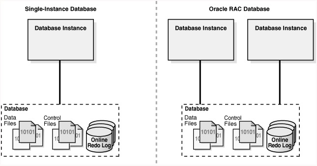
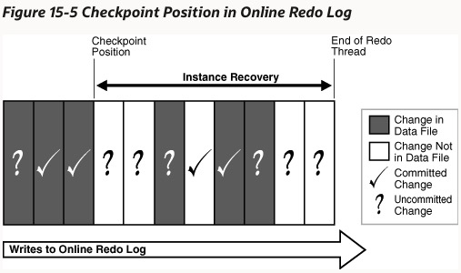
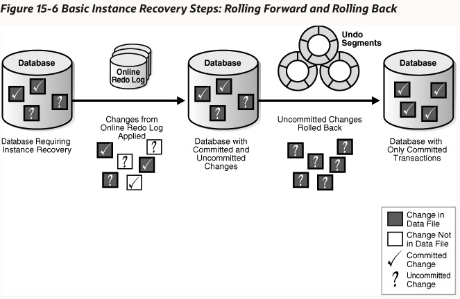
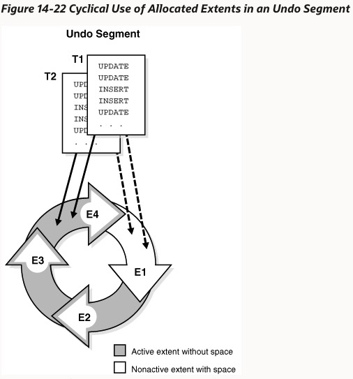

## Oracle Database Instance

database 是磁盘上数据文件的集合，可以独立于 database instance 而存在。21c 版本仅支持多租户容器架构，包含 CDB(multitenant container database)、PDB(pluggable database) 和应用容器 (application container) 三种 database。

database instance 是管理 database 文件的内存结构集合，由共享内存区域 SGA(system global area) 和后台进程组成。instance 也可以独立于 database 文件存在。

database instance 与 database 是一对一（单实例配置）或者多对一（Real Application Clusters RAC 配置）的关系。

database instance 可以配置为读写或者只读的，他们可以同时存在于同一个 database 上。

SID(Oracle System Identifier) 是特定主机上 database instance 的唯一标示。

开启 instance 包含三个步骤，第一阶段是启动 instance，但是没有和 database 绑定；第二阶段是与 database 绑定，读取其控制文件，此时 database 对于其他用户仍然是关闭状态；第三阶段是 database 的数据文件对授权用户都是可访问状态。关闭 instance 的顺序与之相反。

在正常的关闭过程中，instance 会将 SGA 中的数据写入到数据文件和在线 redo log 文件中，然后关闭在线的数据文件和 redo log 文件。此时 database 已经关闭并且不可访问，控制文件仍然是打开状态。当 instance 解除挂载 database 时关闭控制文件。

在异常的关闭过程中，数据库没有将 SGA 中的数据写入数据文件和 redo log 文件中，在下次开启时需要做 instance 恢复的过程。

## Checkpoints

检查点是数据库一致性关闭、实例恢复以及通用操作的重要机制。在 Oracle 中由 SCN(System Change Numeber, 是按照时间顺序 database 发生改变的逻辑位点)表示 redo 流中的检查点位置，是由 database buffer cache 中最老的脏页决定的，存放在控制文件和每个数据文件头部。在检查点时，database 将 cache 中所有修改过的 buffer 写到磁盘中。

检查点的目的在于，减少 instance 或者媒介失败导致的数据库恢复时间、确保周期性的将脏页从内存写入磁盘、在一致性的关闭过程中能将所有提交的数据写入磁盘中。

### 什么时间创建检查点

CKPT(checkpoint process)负责将检查点写入数据文件头部和控制文件。主要的检查点包括三类，第一种是线程检查点，特定线程将 redo 对 buffer 做出的所有修改写入到磁盘中，出现在数据库关闭、在线 redo log 切换等过程中；第二种是表空间和数据文件检查点，出现在一些对表空间或者数据文件操作的场景中，比如将表空间变为只读或将其下线、收缩数据文件等；最常见的是增量检查点，DBW(database writter) 至少每3秒检查一下是否需要将脏页写到磁盘上，避免当在线 redo log 切换时需要写入大量的数据块，当 DBW 写脏页时持续推进检查点位置，在这种情况下 CKPT 仅将检查点位置写入控制文件，而不写入数据文件头。

## Instance Recovery

实例恢复是将在线 redo log 中从最后一次检查点至今所记录到的数据变化重新构造到数据文件中的过程。这个过程自动发生在数据库不一致关闭后的首次开启中，能够保证故障恢复后数据库处于一个一致性的状态。

一个 redo thread 记录一个 instance 对数据库造成的所有改变。单实例架构仅有一个 redo 线程；RAC 架构有多个 redo 线程，每个实例对应一个。

当一个事务提交时，LGWR(log writer process) 将内存中剩下的 redo 记录和事务 SCN 写入到在线 redo log 中。但是，对于 DBW(database writer) 线程来说，会在任何有效的时候将内存中修改过的数据块刷到数据文件中，而不会管造成数据块修改的事务状态，这就导致了未提交的修改可能暂时存在于数据文件中，而提交的修改可能还不存在数据文件中。因此在发生数据库异常关闭后的恢复过程中，需要处理两件事情：

- 已经提交事务对数据块造成的修改，还未写入到数据文件中，仅存在于在线 redo log 中。我们需要根据 redo log 的信息将这些修改重新应用到数据文件。
- 部分未提交事务造成的修改，可能已经在 checkpoint 被写入到数据文件中。这些改变需要被回滚来恢复一致性状态。

实例恢复过程仅需要在线 redo log 和在线数据文件来完成。

### 检查点和实例恢复范围

故障恢复用检查点来决定需要应用到数据文件的改变范围，检查点位置 SCN 保证了所有小于该 SCN 的事务修改已经被保存到了数据文件中。从检查点到 redo 线程结束点的部分改变可能已经被写入到了数据文件，但是是无法保证的，所以整个范围内的修改必须进行重放。

### 实例恢复阶段

第一阶段叫做 cache recovery 或者 rolling forward，将所有在线 redo log 中记录的改变重放到数据文件中。这其中既包括数据的改变，也包括 undo data 的变化。在完成这个过程后，数据库状态为保证到 redo thread 结束点为止，所有已提交的数据被重放到了数据文件中，所有的 undo segments 也被恢复了，还有 checkpoint 之前就已经被写入数据文件、在该阶段重放 redo log 引入的未提交数据。

第二阶段是 rolling back 或者 transaction recovery，通过应用 undo 块来回滚上述未提交数据。在数据库崩溃时，所有的活跃事务都被标记为终止，他们都需要被回滚。数据库可以同时回滚多个事务，因为这些事务在提交前都是不可见的，彼此不存在相互影响。此外，Oracle 不需要等待 SMON(System Monitor Process) 来回滚所有事务，当用户的新事务来访问需要的数据时，也可以回滚独立的数据块。 

## Undo Segments

Oracle 维护事务动作的记录，叫做 undo data。它不是额外的日志，而是类似于数据块的组织方式，存放在数据库中的，当 undo block 被修改时，也会产生对应的 redo log。Undo data 的作用包括：

- 回滚一个活跃的事务
- 崩溃恢复一个终止的事务
- 提供多版本数据，读一致性
- 能够 flash back 访问历史数据或回滚

数据库将 undo data 划分为两个独立的流，分别是持久对象的流和临时对象的流。这样做可以避免将临时对象的 undo data 写入在线 redo log，减少写入量；同时不需要备份临时对象的 undo data。持久对象的 undo data 是存放在一个 undo tablespace 中的，自动管理 undo tablespace 的空间和 undo segment 的保留。

### 组织方式

每个事务开启时，都被绑定到某一个 undo segment 中，transaction table 包含了事务到 undo segment 的映射。多个事务可以并发写入同一个 undo segment 或者不同 undo segment。

一个 undo segment 被划分为多个 extents 组成环状。多个事务可以并发顺序写入一个 extent，或不同 extents。在同一时刻，一个事务只能写入一个 undo segment 的一个 extent。在一个 undo extent 中，又包含多个 data block，每个 data block 仅包含一个事务的 undo data。

当一个 extent 写满之后，首先需要空间的事务会检查下一个 extent 是否包含活跃事务需要的 undo data，如果包含的话，会创建一个新的 extent；否则会覆盖写这个 extent。