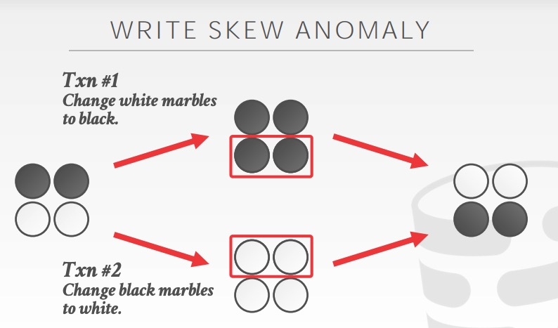
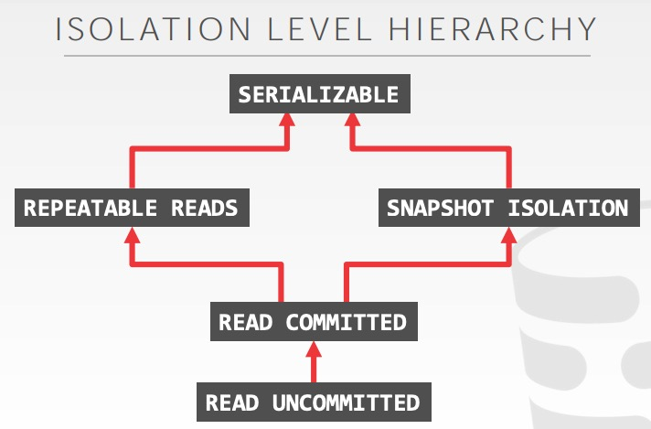

# 03 - Multi-Version Concurrency Control (Design Decisions)

## MVCC 定义

数据库为一个逻辑对象维护了多个物理版本：

- 当一个事务尝试对一个对象进行修改时，它创建了一个该对象新的版本；
- 当一个食物尝试读一个对象时，它读到当该事务开始时已经存在的最新版本。

这样的好处在于，读事务不会阻塞写事务；写事务也不会阻塞读事务。只读事务可以不用获取锁就能够读到一个一致性的快照。

## 快照隔离级别（SI）

- 不会读到当前活跃事务的写入。
- 如果两个事务更新同一个对象，那么新写的人会获胜，取决于写入的时间。

快照隔离级别不是可序列化的，会受到写斜交（WRITE SKEW ANOMALY）问题的影响：

## 隔离级别之间的关系

dirty read 指的是读到其他事务未提交的脏数据，在 READ-UNCOMMITTED 的隔离级别下可能发生。在 MySQL 8.0.18 中实践如下：

| Transaction A                                 | Transaction B                      |
| :-------------------------------------------- | ---------------------------------- |
| BEGIN;                                        | BEGIN;                             |
| SELECT a FROM test WHERE b = 0; -- 返回 a = 1 |                                    |
|                                               | UPDATE test SET a = 0 WHERE b = 0; |
| SELECT a FROM test WHERE b = 0; -- 返回 a = 0 |                                    |
|                                               | ROLLBACK;                          |
| SELECT a FROM test WHERE b = 0; -- 返回 a = 1 |                                    |

non-repeatable read 指的是不可重复读，同样的 query 在一个事务里多次读到的同一条数据不一致，在 READ-COMMITTED 的隔离级别下可能发生。

| Transaction A                                 | Transaction B                      |
| :-------------------------------------------- | ---------------------------------- |
| BEGIN;                                        | BEGIN;                             |
| SELECT a FROM test WHERE b = 0; -- 返回 a = 1 |                                    |
|                                               | UPDATE test SET a = 0 WHERE b = 0; |
| SELECT a FROM test WHERE b = 0; -- 返回 a = 1 |                                    |
|                                               | COMMIT;                            |
| SELECT a FROM test WHERE b = 0; -- 返回 a = 0 |                                    |

phantom read 指的是幻影读，在同样的查询条件下，多次查询可能不同的结果（有新增的数据）。MySQL 中呈现幻读不是很容易：

| Transaction A                                          | Transaction B              |
| :----------------------------------------------------- | -------------------------- |
| BEGIN;                                                 | BEGIN;                     |
| SELECT a FROM test WHERE b = 0; -- 返回 a = 1          |                            |
|                                                        | INSERT test VALUES (2, 0); |
|                                                        | COMMIT;                    |
| SELECT a FROM test WHERE b = 0; -- 返回 a = 1 一条记录 |                            |
| UPDATE test SET a = 1 WHERE b = 0; -- 影响两条记录     |                            |
| SELECT a FROM test WHERE b = 0; -- 返回 a = 1 两条记录 |                            |

在 REPEATABLE READ 隔离级别下，可能出现幻读，不会出现写斜交异常（不知道这里的 WRITE SKEW ANOMALY 怎么翻译好？）；在 SNAPSHOT ISOLATION 情况下，不会出现幻读，可能出现写斜交乱象。

## 并发控制协议

乐观并发控制（OCC）是时间戳顺序（MVTO，Timestamp Ordering）的一个变种，在于OCC是在自己的私有空间里创建新的version，在提交前别的事务是不可见的，Timestamp Ordering是直接在原数据上修改，其他事务可见。