# 物理存储结构

database 包含三种物理存储文件：
- data file 是存储用户数据的文件，包括表和索引；temp file 是临时表空间的数据文件。CDB 和 PDB 有独立的 data file 和 temp file。
- control file 是追踪 CDB 物理组成部分的根文件。PDB 没有自己的 control file。
- online redo log 是记录对 CDB 数据库造成改变的文件集合。PDB 没有独立的 online redo log。

## Data File

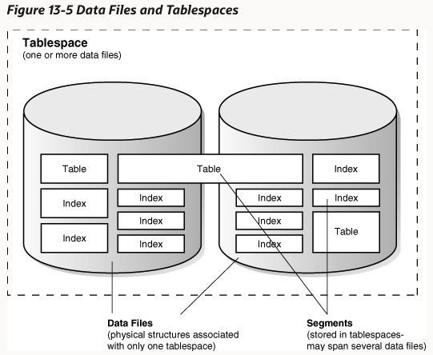

tablespace 是一个逻辑上的结构，数据库的数据存放在多个 tablespace 中，tablespace 的数据存放在 data file 中，一个 tablespace 由一个或多个 data file 组成。未分区的 schema 对象或 schema 对象的多个分区存放在各自的 segment 中，一个 segment 可以跨越多个 data file，但是只属于一个 tablespace。

一个 CDB 包含 SYSTEM tablespace(存放数据字典，包含表元数据的表集合)、undo tablespace 和 temporary tablespace  等。

临时表空间包含仅在会话期间有效的临时文件，通常是为数据 hash、排序等操作的特殊文件。临时文件是不带有 redo log 记录的。

database 在一个 tablespace 里创建 data file 是通过分配指定大小的磁盘空间和文件头（包含 data file 的元数据，包括文件大小、检查点 SCN、在整个 database 唯一的绝对值文件号和在 tablespace 里相对的文件号）需要的空间。分配完后，数据空间就已经格式化了，但是不包含任何用户数据。随着用户数据的增长，使用 data file 里的空闲空间来为 segment 分配 extent。

在 tablespace 中的更新和删除会造成一些空洞的空间，有些不够大不足以被新数据复用，叫做碎片化空闲空间（fragmented free space）。

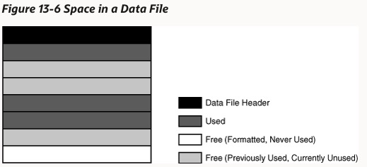

## Online Redo Log

数据库维护 redo log 的最主要作用就是数据恢复、防止数据丢失。database 同一时间仅使用一个 redo log 文件来存放 redo log buffer 中写入的记录。如果当前 redo log 文件写满、在特定间隔或者手动切换后，会换到下一个 redo log 文件写入，每个文件都会被指定一个新的 LSN(log sequence number)。

当最后一个 redo log 文件写满后，会重新复用第一个 redo log 文件，复用的条件有两个：
- 如果没有开启归档，被复用的 redo log 文件所包含的数据变化必须已经在检查点被写入了磁盘中。
- 如果开启了归档，那么在上述条件之外，还要求该文件已经被归档。

归档后的 redo log 文件可以看作是数据库的一个备份和恢复策略，能够用它来更新 standby 数据库，或者通过工具对数据库的历史有所了解。

Online redo log file 中包含多个 redo record，一条 redo record 由一组改变因素组成，各自描述了对 data block 的变化。例如，一行表记录的更新会产生一条 redo record 描述对表中 data segment block 的改变、undo segment data block 的改变和 undo segments 中 transaction table 的改变。

redo record 中包含了所有跟改变相关的元数据，包括：
- SCN 和改变时间戳
- 产生变化的事务 ID
- SCN 和事务提交的时间戳（如果提交的话）
- 造成改变的操作类型
- 被改变的 data segment 的名字和类型

# 逻辑存储结构

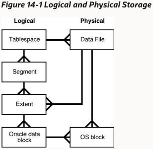

- data block 是 Oracle 数据库中最小的逻辑存储单元，也叫做 page，一个 data block 代表特定数量字节的存储空间。例如上图中的 2KB，data block 可能存放在磁盘、SSD 或者 PMEM(Persistent Memory)媒介上，但是数据库不关心底层是怎么存的，在访问和更新上都是逻辑的。
- extent 是为了存放特定类型信息而分配的多个逻辑连续 data block。例如 24KB 的 extent 包含 12 个 data block。
- segment 是为了特定数据库对象（table、index 等）而分配的 extent 集合，比如用户 segment、undo segment、临时 segment。例如某个表中的所有数据都存放在 data segment 中，每个 index 都存放在各自的 segment 中，每个消耗存储的数据库对象都由单个 segment 组成。
- tablespace，包含一个或多个 segment 的数据库存储单元。每个 segment 都仅属于一个 tablespace，tablespace 可以包含多个 data file，segment 也可以跨 data file，但是一个 extent 不能跨 data file。

## Data Block

data block 是数据库 IO 的最小单元，尽管在物理层面，数据存放在磁盘文件中的操作系统 block。操作系统 block 是操作系统进行读写的最小数据单元，data block 的结构和大小对操作系统是无感知的。为了性能考虑，data block 的大小必须是操作系统 block 的整数倍。

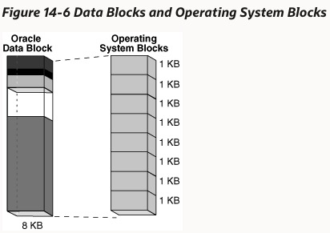

Oracle 默认的表存储结构是堆表，数据在堆表中是无序存放的，使用 page directory 来维护 data block 和数据的位置。每个 data block 都会有内部结构来帮助 database track 其中的数据和空闲空间，不管 data block 是存放表、索引还是 table cluster data。这个结构叫做 data block overhead，包括以下几部分：

- block header，包含 block 的 general 信息，有磁盘地址、segment 类型。还有活跃和历史事务信息，对于每个更新该 block 的事务，都需要有一个事务条目，大约 23 字节。
- table directory，包含数据属于的表的元数据。
- row directory，描述数据部分每行的位置。一行数据可能放置在 data block 下方数据部分的任意位置，行地址（行开头）被记录在 row directory 向量槽的一个槽中。当一行数据在同一个 block 中进行移动时，会更新 row directory 中的位置，但是 row number 保持不变，说明 row number 是一个逻辑值。

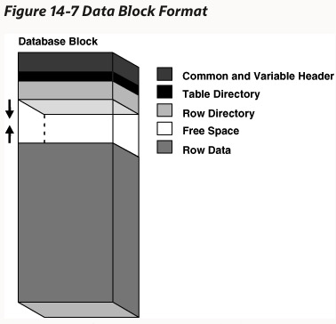

data block overhead 的某些部分大小是固定的，总长是变化的，平均在 84～107 字节。

### Row Format

数据的每一行是变长存放的，一行数据存放在一个或多个 row piece 中。当一行数据能完整的存放在一个 data block 中时，仅包含一个 row piece；当一行数据无法放进一个 block 中，或者因为更新需要拓展到下一个 block 中时，会出现多个 row piece，每个 data block 最多包含每行的一个 row piece。

row piece 也包含内部结构（row header）来帮助数据库 track 内部的数据（也包括分布在其他 block 中的 row piece），column data 存放各列的数据。每个完整行都有至少 3 字节的 header。

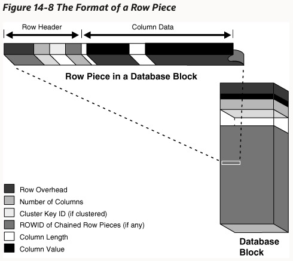

### Rowid Format

Rowid 是由字母和数字组成的字符串，是一个逻辑结构，并没有实际存放在数据库中，而是从行数据存放的文件和 data block 中推导出来的。data object number 标示了数据存放的 segment。

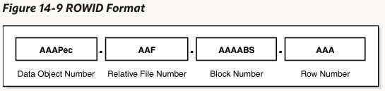

data block 可以进行压缩来消除其中存放的重复列值，会在 data block 头部存放一个符号映射表，用较短的符号（%、*)来映射长的重复字段，在实际存放时就可以仅存放短符号。

### Data Block 的空间管理

database 在填满一个 data block 的时候是从下往上的，因此在行数据和 block header 的空闲空间减少。对现有数据的更新，例如将一个 null 值更改为 non-null 值也会使空闲空间减少。有一个参数 PCTFREE 是用来控制 data block 中最少预留的空闲空间比例，需要避免空闲空间太小时，对现存数据更新会导致列迁移；或者空闲空间较大时，空间的浪费。

在一些情况下，会导致 data block 中的空闲空间增加：

- DELETE 操作
- UPDATE 操作要么将现存的值改为更小的值，要么增加一行的值大到其必须迁移到别的 block
- INSERT 操作插入数据到使用列压缩的表

如果 INSERT 操作填满一个 block 之后，会触发数据库 block 压缩，也会导致更多的空闲空间。

只有在两种情况下，被释放的空间可以被 INSERT 使用：

- INSERT 操作发生在同一个事务中，空闲空间是由前面的语句释放的
- INSERT 操作发生在不同事务中，只有在释放空间的事务提交之后，这部分空间才能被使用

被释放的空间在 data block 中可能不是连续的，被称为碎片化空间（fragmented space）。在特定情况下，database 会自动透明的合并碎片化空间：

- INSERT 或 UPDATE 语句尝试使用一个包含足够的空闲空间来存放新的 row piece 的 block
- 空闲空间是碎片化的，无法找到一个连续空间来插入 row piece

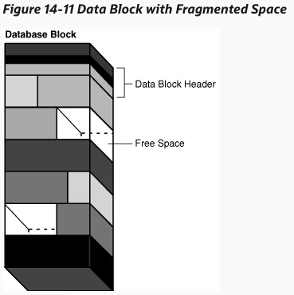

经过合并碎片空间后，data block 中空闲空间的总量是不变的，但是排布方式发生变化，空闲空间变得连续。只有在上述情况下会发生碎片合并，否则过于频繁的碎片合并会影响效率。

#### 链状和迁移行（Chained and Migrated Rows）

database 使用 chaining 和 migration 来管理太大无法放入单个 block 的行：

- 当某行在初次插入时过大，无法放置在一个 data block 时，会分布在多个 data block 中，彼此用链状连接起来
- 当原本能够放入 block 的某行数据更新后，新的长度无法放入当前 block，将会把整行移动到新的 block 中，并且在原位置用指针指向新的位置，因此该行数据的rowid 不发生变化
- 包含超过 255 列的行，由于 row piece 中最多能存放 255 列数据，所以包含 1000 列的数据需要放在 4 个 block 中连接起来

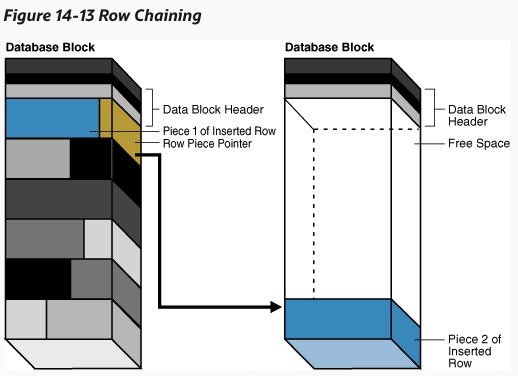

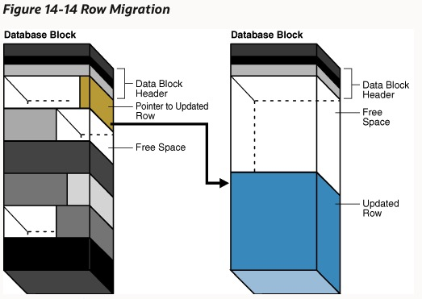

## Index Block

索引由三种类型的 block 组成：

- root block，表示索引的入口
- branch block，database 通过 branch block 来搜寻索引键值
- leaf block，存放索引键和 rowid 索引值（可以指向对应的列）的 block，leaf block 按照键值顺序存放，可以高效搜寻范围键值

索引条目在 index block 中的存放与数据行在 data block 中的存放类似，以堆的方式。但是对于 row directory 的管理存在不同，在 index block 中，row directory 是按照键值排序的。当范围查找时，可以根据二分查找迅速找到范围内的起始键值，然后顺序处理直到最后一个键值。

当索引数据发生变化时，被删除的索引键值空间不会自动释放，而是作为一个空的 slot，后续的插入数据如果合适的话，可以复用这些 slot。

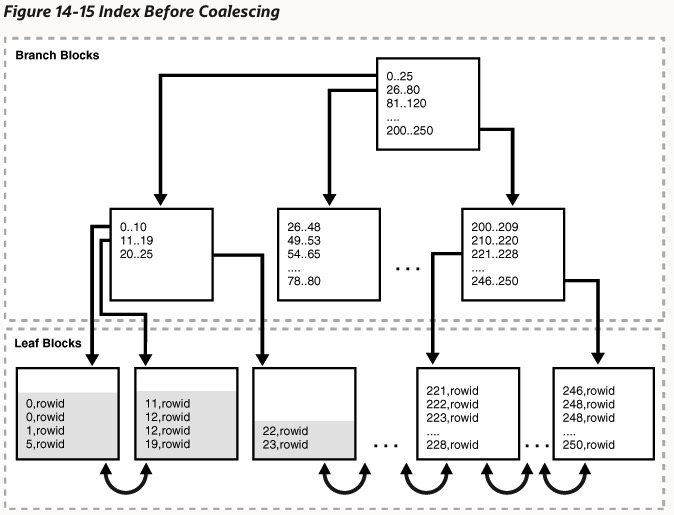

## Extent

Extent 在同一个 segment 中的分配可能不是连续的，按需分配，分散在多个 data file 中。segment 的第一个 data block 包含了该 segment 的 extent directory。在数据删除后，extent 的空间不是立即回收的，除非执行 DROP 对象命令、数据迁移到新的 tablespace、重建或者合并索引等。

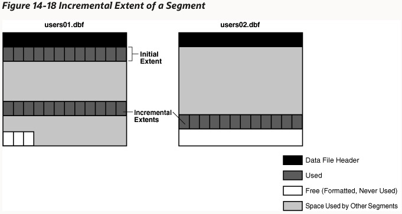

