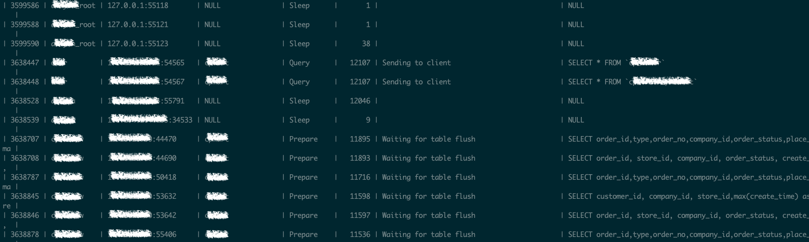

# 总结

## 事件整体过程

1. 线程 1 执行大查询`SELECT * FROM tp`（客户端没有及时处理返回结果，或者由于网络问题，服务端一直尝试往 socket send buffer 中写入部分结果，导致线程查询处于 Sending to client 状态，一直持有 TABLE cache 资源）。
2. 线程 2 执行了`FLUSH TABLES WITH READ LOCK`（成功推高整体表 version，由于线程 1 一直存在，无法等到 TABLE cache 全部 flush，返回 MDL 锁等待超时错误，但表 version 推高的效果仍然保留）。
3. 其他 DML 线程发现当前的 TABLE version 仍然是老的，一直等待线程 1 flush 旧的 TABLE。

## 收获

除了 MySQL 网络 IO、FLUSH TABLES WITH READ LOCK 原理外，在处理所有线程等待的紧急情况时，可以先找到持续时间最长的那些线程，观察线程状态的不同，很有可能是由于那些线程导致的其他线程等待。

# 线上现象

在值班时遇到一个比较紧急的情况，所有在某个数据库的查询都 hang 住，处于 Waiting for table flush 状态，这时数据库处于基本不可用状态。查阅[General Thread States](https://dev.mysql.com/doc/refman/8.0/en/general-thread-states.html)得知这个状态是线程执行 FLUSH TABLES 等待其他线程释放旧的表对象，或者其他的线程得知由于 DDL 等语句导致表结构发生变化，需要等待所有的线程释放旧的 TABLE cache 对象后重新打开表。

查询审计日志后发现，用户在之前执行过`FLUSH TABLES WITH READ LOCK`命名，但是执行的结果是失败，ER_LOCK_WAIT_TIMEOUT(1205) 错误。

面对这种现象，可能情况是某个线程一直持有旧的 TABLE cache 对象未释放，导致所有的后续查询 hang，一种可行的办法是找到最老、执行时间最长的线程，于是我们翻阅 processlist 列表，找到了这样的线程。



有两个线程比较奇怪，长时间处于 Sending to client 状态，意味着服务端写 buffer 发送给客户端堵住了，为了及时止损，将这两个线程 kill 后恢复。后续我们再尝试复现和研究这起事件的根因。

# 复现 MySQL 客户端处理结果慢导致服务端线程一直阻塞在写缓冲区阶段

Sending to client 是 MySQL net buffer 缓存的数据满了之后，将数据写入操作系统的 socket send buffer 发送给客户端时的状态，如果客户端处理数据的速度较慢，没有及时获取 socket send buffer 中的数据，是会导致其塞满，MySQL 写入等待，长时间处于 Sending to client 的状态。我们通过客户端程序来模拟这一现象。


## 客户端程序

```python
#!/usr/bin/python3

import pymysql
import time

db = pymysql.connect(host='xx.xx.xx.xx', port=12231,
                     user='test',password='123456', database='test',
                     cursorclass=pymysql.cursors.SSDictCursor) # cursor 种类必须指定

# 使用 cursor() 方法创建一个游标对象 cursor
cursor = db.cursor()

# 使用 execute() 方法执行 SQL 查询
cursor.execute("SELECT * FROM tp")

# 使用 fetchone() 方法获取单条数据
data = cursor.fetchone()

times = 0

while data:
    print (data)
    if times < 10:
        time.sleep(30)
        times = times + 1

    data = cursor.fetchone()

# 关闭数据库连接
db.close()
```

实测必须指定 cursor 种类，否则默认的 cursor 仍然会在 execute() 时获取所有的结果进行缓存，后续的 fetchone() 函数只是从缓存中不断获取每行记录。

SSDictCursor 的 cursor 种类不带有缓存，每次只从 socket receive buffer 中获取全部的数据，在读取完全部的数据前不会清空缓冲区，继续从服务端获取。这样通过 sleep 函数我们就可以模拟客户端对缓冲区的数据处理慢的现象，因此模拟出服务端无法向客户端发送结果时的场景。

## 服务端

```
root@localhost:(none) 8.0.13-dev-debug> show variables like 'net_%';
+-----------------------+-------+
| Variable_name         | Value |
+-----------------------+-------+
| net_buffer_length     | 16384 |
| net_compression_level | 6     |
| net_read_timeout      | 30    |
| net_retry_count       | 10    |
| net_write_timeout     | 60    |
+-----------------------+-------+

$cat /proc/sys/net/core/wmem_default
262144
```

我们提前构建了一张表，数据量无法容纳在一个 16KB 的 net_buffer 中，也无法容纳进一个 256KB 的 socket send buffer 中。服务端将断点打在 net buffer 满，写 packet 函数 net_write_packet 上，然后用客户端执行上述全表扫描语句。

断点会停在以下写查询结果的栈中：
```
#0  net_write_packet (net=0x7ffc7b40d080, packet=0x7ffc7b4dc660 "\001", length=16384) at sql-common/net_serv.cc:828
#1  0x00000000046a8fca in net_write_buff (net=0x7ffc7b40d080, packet=0x7fffc71b12e4 "&", len=4) at sql-common/net_serv.cc:501
#2  0x00000000046a8c4d in my_net_write (net=0x7ffc7b40d080, packet=0x7ffc7b4a90e0 "\004\067\063\066\061 ad0a7490c114208946f5e660a7110e6c", '\245' <repeats 1962 times>..., len=38) at sql-common/net_serv.cc:388
#3  0x0000000004affae9 in Protocol_classic::end_row (this=0x7ffc7b40c908) at sql/protocol_classic.cc:3141
#4  0x0000000004b027e4 in Query_result_send::send_data (this=0x7ffc7b5d9d90, items=...) at sql/query_result.cc:110
#5  0x0000000004381ef0 in end_send (join=0x7ffc7b41cb88, qep_tab=0x7ffc7b41d988, end_of_records=false) at sql/sql_executor.cc:3267
#6  0x000000000437de2f in evaluate_join_record (join=0x7ffc7b41cb88, qep_tab=0x7ffc7b41d6c0) at sql/sql_executor.cc:1974
#7  0x000000000437d0b7 in sub_select (join=0x7ffc7b41cb88, qep_tab=0x7ffc7b41d6c0, end_of_records=false) at sql/sql_executor.cc:1636
#8  0x000000000437c3fb in do_select (join=0x7ffc7b41cb88) at sql/sql_executor.cc:1230
#9  0x0000000004379413 in JOIN::exec (this=0x7ffc7b41cb88) at sql/sql_executor.cc:303
#10 0x000000000448ba55 in Sql_cmd_dml::execute_inner (this=0x7ffc7b5d9d50, thd=0x7ffc7b40b000) at sql/sql_select.cc:937
#11 0x000000000448b002 in Sql_cmd_dml::execute (this=0x7ffc7b5d9d50, thd=0x7ffc7b40b000) at sql/sql_select.cc:670
```

当 net buffer 第一次满，向 socket send buffer 写入数据后，客户端 socket receive buffer 就能够立马收到 packet 并一条条处理数据，但是缓冲区中接收到的数据处理完之前，不会再去接收数据。由于 sleep 函数的存在，服务端 socket send buffer 中的数据无法发出去，在以上断点总共碰到 15 次，约等于写入 15 * 16 KB = 240 KB 后（算上其他头字节，大概就是占满 socket send buffer 的大小），进入写等待状态。此时`SHOW PROCESSLIST`是以下状态：

```
root@localhost:(none) 8.0.13-dev-debug> show processlist;
+----+-----------------+----------------------+------+---------+------+------------------------+------------------+
| Id | User            | Host                 | db   | Command | Time | State                  | Info             |
+----+-----------------+----------------------+------+---------+------+------------------------+------------------+
|  4 | event_scheduler | localhost            | NULL | Daemon  |   50 | Waiting on empty queue | NULL             |
| 13 | root            | localhost            | NULL | Query   |    0 | starting               | show processlist |
| 14 | test            | 30.212.182.230:56383 | test | Query   |   10 | Sending to client      | SELECT * FROM tp | <-- Time 增长至 60 后断开
+----+-----------------+----------------------+------+---------+------+------------------------+------------------+
3 rows in set (0.00 sec)
```

等待 net_write_timeout 60s 后，报错：
```
#0  vio_should_retry (vio=0x7ffc7b4099a0) at vio/viosocket.cc:396
#1  0x00000000046a8ac2 in net_should_retry (net=0x7ffc7b40d080, retry_count=0x7fffc71b1204) at sql-common/net_serv.cc:245
#2  0x00000000046a9116 in net_write_raw_loop (net=0x7ffc7b40d080, buf=0x7ffc7b4ddfd1 "6983be4b020ffc6a6938569cf&", count=9871) at sql-common/net_serv.cc:547
#3  0x00000000046a93be in net_write_packet (net=0x7ffc7b40d080, packet=0x7ffc7b4dc660 "ad589&", length=16384) at sql-common/net_serv.cc:854
#4  0x00000000046a8fca in net_write_buff (net=0x7ffc7b40d080, packet=0x7ffc7b4a90e0 "\004\063\067\071\060 55328be7b6598805bb37df7ca86bae3b", '\245' <repeats 1962 times>..., len=38) at sql-common/net_serv.cc:501
#5  0x00000000046a8c8c in my_net_write (net=0x7ffc7b40d080, packet=0x7ffc7b4a90e0 "\004\063\067\071\060 55328be7b6598805bb37df7ca86bae3b", '\245' <repeats 1962 times>..., len=38) at sql-common/net_serv.cc:394
#6  0x0000000004affae9 in Protocol_classic::end_row (this=0x7ffc7b40c908) at sql/protocol_classic.cc:3141
#7  0x0000000004b027e4 in Query_result_send::send_data (this=0x7ffc79754590, items=...) at sql/query_result.cc:110
#8  0x0000000004381ef0 in end_send (join=0x7ffc7b41cb88, qep_tab=0x7ffc7b41d988, end_of_records=false) at sql/sql_executor.cc:3267
```

此时 VIO 的错误号为 SOCKET_ETIMEDOUT，不会进行 retry，将会标记 ER_NET_WRITE_INTERRUPTED 错误后断开连接。

客户端最后会收到之前服务端写入 socket send buffer 中的全部数据和`Error Code: 2013. Lost connection to MySQL server during query`错误。

# 为什么执行失败的 FLUSH TABLES WITH READ LOCK 也会导致所有线程 hang 住

`FLUSH TABLES WITH READ LOCK`是将所有表的版本推高，在全局加 GLOBAL READ MDL Lock，在实现上是通过`handle_reload_request`函数依次调用`Global_read_lock::lock_global_read_lock`和`close_cached_tables`来实现的。

由于 MySQL 的 DML 语句判断表是否为老版本时是通过比较 TABLE_SHARE 的 version 和全局的 refresh_version 的，所以这里比较巧妙的实现是直接将 refresh_version 加 1，这样所有的 DML 语句在访问旧表时都会认为是旧版本，等待 TABLE cache flush。同时也会将旧的没有使用的 TABLE cache 直接关掉。

但是在之后，如果发现仍然存在旧版本的 TABLE cache 没有 flush 完，该语句会借助 MDL 的等待机制去等待 TABLE cache flush。所以当有个长线程一直处于 Sending to client 状态时，会导致该命令的 MDL 锁等待超时 lock_wait_timeout，返回失败的结果。

但是 refresh_version 的推高是不可逆的结果，也就是说即使最后该命令返回失败的结果，但是实际产生的 TABLE flush 的效果还是存在的。不知道这算不算是 MySQL 社区设计的一处缺陷，至少这条语句`FLUSH TABLES WITH READ LOCK`是不满足原子性的。

由于长线程一直存在，也会导致后面的 DML 线程都需要等待 TABLE flush，进入等待状态，引起了数据库的雪崩。这个现象在 kill 掉长线程后恢复。从现场图中也可以看到，这两个造成事故线程所处于的状态，也是与其他线程的状态有较为明显的差别，比较好辨认。


