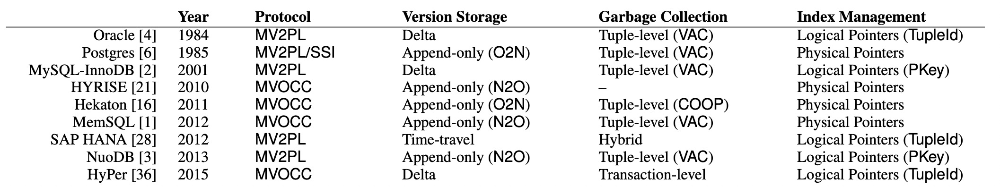
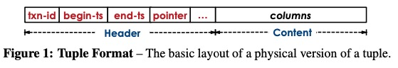
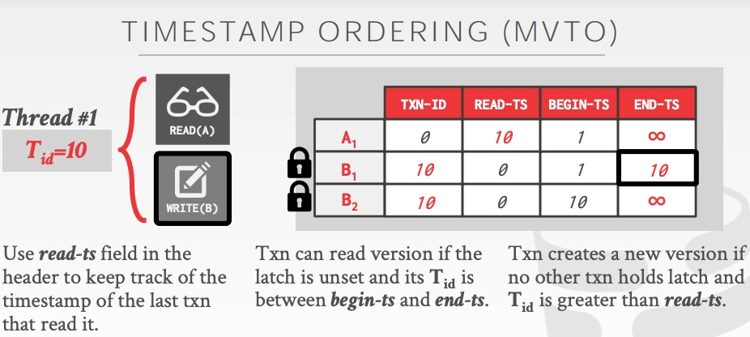

# An Empirical Evaluation of In-Memory Multi-Version Concurrency Control

> 这篇文章对经典的多版本并发控制方式、版本存储、垃圾回收、二级索引管理做了详尽的介绍，并且通过在全内存数据库 Peloton 中进行实现，通过实验来验证这几种方式的差异和性能对比。

## 多版本

如果数据库中的最基本对象——一行数据（tuple）只要一个版本的话，所有对同一个对象的读写请求都必须顺序进行，有事务正在读取该对象时，其他事务不能删除或者修改对象；有事务正在写该对象时，其他事务不能读到不完整的对象。这会大大降低数据库对于请求处理的并发性。因此现代数据库会采用冗余存储的方式来增加并发性，通过存储同一个对象的多个版本数据来实现读写事务的不冲突：

- 当写事务对对象进行修改时，会创建对象的一个新版本；
- 当读事务对数据读取时，会寻找到事务开始时已经存在并提交的最新版本的数据。

在这个过程中，读写事务如何进行协调，结合数据库对于事务管理上一些中心化的元数据来判断数据版本的可见性，就是并发控制协议锁讨论的内容。

## 并发控制协议

与并发控制相关的元数据包括事务级别的和记录级别的：

- 事务级别的是每个事务都会被分配一个单调递增的事务 id 或者时间戳，来标记事务的先后顺序。
- 每条记录的头部也会有和事务相关的字段，包括事务 id（哪个事务正在访问 / 修改该条记录，可以作为互斥写锁使用）、begin-ts 和 end-ts 表示该条记录版本可见的时间戳范围、pointer 链表指针来指向该记录的其他版本，如下图所示。

接下来几种并发控制协议就是通过使用这些信息，结合不同的中心化事务管理信息来完成版本可见性的管理，主要包含两个方面：

- 是否允许让一个事务能够访问 / 修改某个具体版本的数据；
- 是否允许一个事务提交它的修改。

### MVTO

在 MVTO 协议中，对于数据的读取是严格按照时间戳（事务 id）顺序的，tuple 的 txn-id 字段被当作一个写锁来使用。

**读事务**

当读事务进来时，会找到该条记录可见的一个版本。如果该版本的 txn-id 为 0，表示没有被其他事务上写锁，可以正常读，在这个期间，写事务也是可以进来的，因为写操作不会影响原有版本，只会创建新版本。我认为写事务只需要标记修改前的最新版本和修改后的未提交版本的 txn-id 为写事务 id 即可，对于更旧的版本，读事务应该是可以去读的。

同时读事务读取后会将自己的 txn-id 记录到记录里的一个额外头字段 read-ts 里，表示该条记录已经被读到的最大事务 id，如果有旧事务尝试对该记录更新但是 txn-id 小于这个已被读到最大事务 id，写事务就必须放弃。

如果读事务可见的版本的 txn-id 被写锁占住，那么就必须放弃或等待。

**写事务**

写事务只能对最新的版本进行修改，如果发现写事务可见的版本是一个旧版本，那么说明已经有更新的事务修改过这条记录，旧事务不能覆盖修改。

当最新的版本记录上 txn-id 为 0，没有被占住写锁时，当前事务就将该字段改写为自己的事务 id，并且将更新未提交的新版本记录也加锁防止其他事务读取。当提交后更新原记录的 end-ts，并释放写锁，将 txn-id 恢复为 0。

### MVOCC

乐观并发控制，核心的思想是各个事务在过程中认为是彼此不冲突的，可以各做各的修改，但是修改也是在私有空间内进行，提交前其他事务看不到。分为三个阶段：

- 第一个是读阶段：找到当前事务可见的版本，然后在私有空间内修改，并且记录下读取过的 read_set 集合；
- 第二个阶段是提交前的验证阶段：验证之前读到过的记录集合，是否已经被其他的事务更新并提交了，因为修改一定是要基于最新的版本，如果有更新的事务已经对读到的旧数据进行了修改，那么当前事务需要回滚；
- 第三个阶段是写阶段，将私有空间里的新版本写回公共记录空间，并且使用新的提交时间戳。

由于读写事务，写的结果可能受到读取结果的影响，所以必须验证读过的记录没有在事务期间被其他事务修改；但是我觉得对于只读事务，由于没有需要写的内容，所以验证阶段和写阶段应该都可以跳过。

### MV2PL

两阶段上锁是一个比较通用的概念，指的就是在访问公共资源时，第一阶段上锁，在访问结束后第二阶段释放锁。通过在记录里新增 read-cnt 字段，使用 txn-id 与 read-cnt 两个字段结合起来完成读写锁功能。

**读事务**

找到可见的版本，在 txn-id 为 0 时，增加 read-cnt 的值进行读取；如果 txn-id 不为 0，说明有事务正在修改，放弃。

**写事务**

当 txn-id 和 read-cnt 都为 0 时，写事务加写锁，将 txn-id 修改为当前事务 id，并修改。

不同的 2PL 算法的关键不同点在于他们如何处理死锁问题，研究证明不等待的策略是最能够进行拓展的方式，当无法立即获得锁时直接放弃，而不是等待锁释放。

### Serialization Certifier

序列化证明者，既不用像 MVTO 增加 read-ts 字段来防止修改未来事务读到过的数据，也不用采取像 OCC、2PL 的其他方式来保证事务性。而是数据库系统通过维护事务间的反向依赖链来探测异常，并且放弃冲突事务的其中一个。

## 多版本存储

### 追加写存储

维护多版本的数据有几种方式，第一种是追加写的方式，写的内容是完整的数据拷贝，当对数据进行修改时，会在同一个表空间内申请新的空间，然后将旧版本数据拷贝到新的空间里，最后在新的空间完成修改。由于难以实现无锁维护双向链表，因此数据记录里的 pointer 维护的版本链一定是单向的，要么从新记录指向旧记录（N2O），要么由旧记录指向新记录（O2N）。

**N2O**的好处在于读请求不用遍历版本链，很容易就能读到最新版本的数据。但是索引的维护比较麻烦，更新数据时，需要更新所有的索引让它指向最新版本的头部。由一种优化方式是建立逻辑 id 到物理地址的映射表，对于索引来说只需要指向逻辑地址，在更新数据时更新逻辑映射关系即可。

**O2N**的好处就是更新数据时，不用更新索引指向，但是访问数据时需要遍历较长的版本链。

对于 non-inline 的数据类型，例如 BLOB。每次更新时都频繁的拷贝是一个比较大的问题，可以在记录中只存储 BLOB 数据的地址，将实际 BLOB 值存放在单独空间，使多版本数据能共享同一份 BLOB 数据。

### Time-Travel Storage

时空旅行存储实际于追加写类似，区别在于将多版本数据存储在独立的表空间中，这样只要保留这部分旧版本数据，就可以访问历史数据。在主表空间中保留当前最新版本的数据。

### Delta 存储

与时空旅行存储相似，在主表中存放当前最新版本的数据，在独立的空间中存储旧版本的值，这样可以减少更新操作需要拷贝的数据量。但是对于读取多个属性的查询来说，需要遍历多个版本链来恢复可见的数据。

## 垃圾回收

对于不再有用的旧版本数据，需要进行垃圾回收，一方面是释放存储，另一方面是缩短版本链也可以使查询更高效。这些旧版本数据由两方面组成：1. 未提交的无效版本数据。2. 不再对任何事务可见的旧版本数据。

### 元组维度

**后台清理线程**

系统中会维护最小的活跃事务 id，后台自动扫描清理不再对活跃事务可见的版本，可以通过 bitmap 来标记脏块，来避免扫描上一次 GC 后没有被修改的数据重复扫描。

**协作清理**

由查询线程协作来完成垃圾清理，要求必须是 O2N 的方式来维护版本链，否则读事务完全不会读到旧版本的数据，也无法标记回收。

### 事务维度

划分 epoch，每个 epoch 包含当时活跃的事务，当事务提交后，从 epoch 中移除该事务。如果之前的 epoch 不包含更旧的活跃事务，那么当前 epoch 的所有事务产生的旧版本都将不可见，所以都可以回收。

## 索引管理

基本上索引管理是和多版本信息分开来进行存储的，在索引中没有的记录，一定是不存在；在索引中存在的记录，也不一定被事务可见。

索引分为逻辑指针和物理指针，通过逻辑指针可以将索引和对象的逻辑 id 例如主键绑定起来，这样可以避免在更新数据时需要更新所有的索引。物理指针只有 append-only storage 才支持，因为只有这种多版本存储方式对于每个版本数据都有独立的物理地址与之对应。