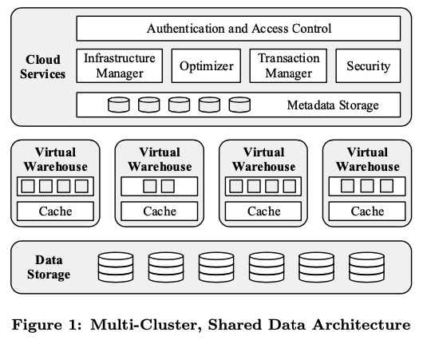
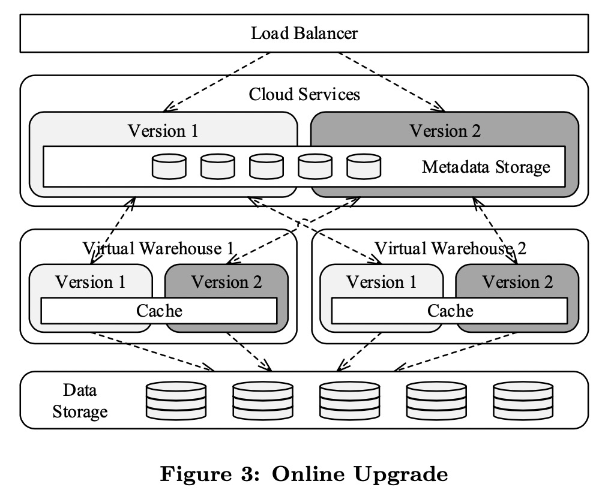
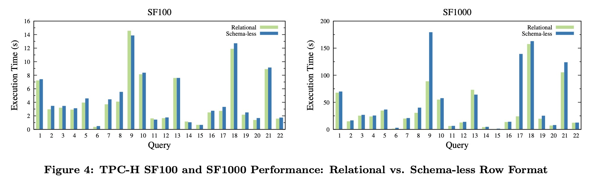
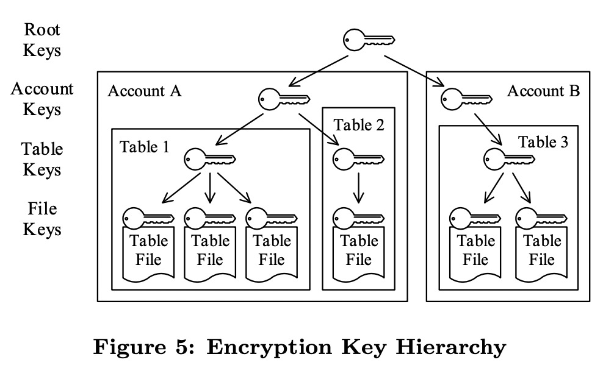
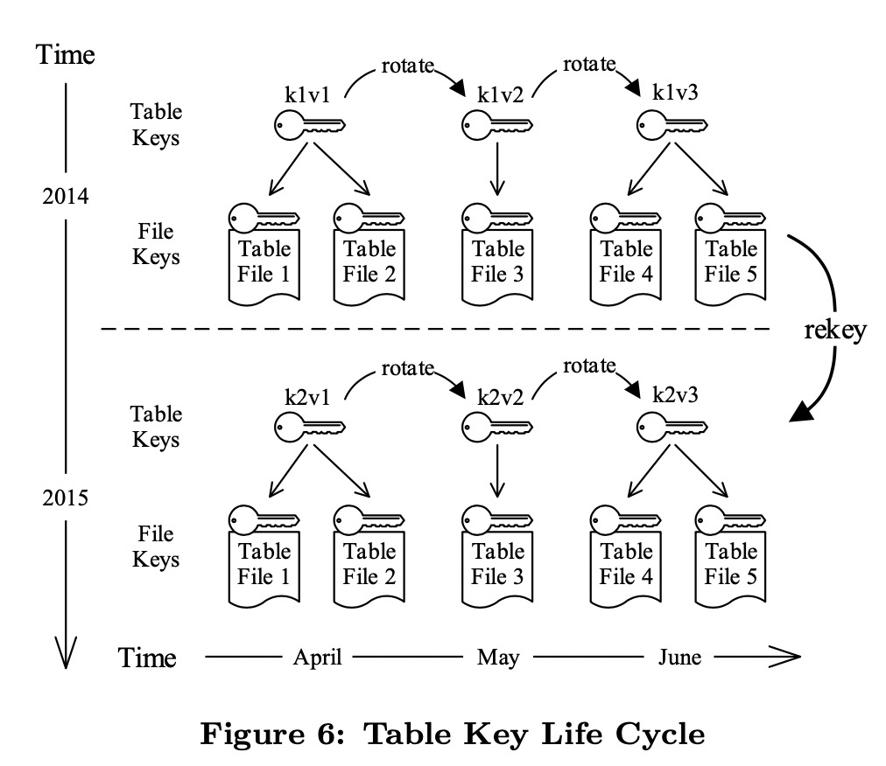

# The Snowflake Elastic Data Warehouse

> 传统的数据仓库是为固定的资源所设计的，从软件层面无法利用云的弹性。同时他们依赖于复杂的ETL(Extract-Transform-Load)流水线来进行数据转化，与云时代数据的实时性需求不符。同时系统需要用户进行复杂的手动调优。
> 
> Snowflake是一个云原生数仓，采用计算-存储分离，计算层无状态，达到弹性、按需付费，实时访问海量数据的需求。同时支持半结构化数据和无schema数据的列式存储、内置转换抽取和SQL访问支持，通过一个系统同时满足大数据和数仓的需求，取代ETL链路。是一个多租户、支持事务、高拓展性和可用性的系统，可支持PB级别的数据访问。

# Snowflake的重要特征

- **Software-as-a-servive 体验**：用户不需要购买任何机器或者软件，只需要在AWS上购买服务，利用已经存在的数据或者上传数据就可以进行数据查询。

- **弹性**：存储和计算资源可以独立、无感知的拓展，对于数据的可用性和并发查询的性能没有影响。

- **高可用性**：Snowflake可以容忍节点、集群、甚至数据中心的故障，可以在线升级，在软件/硬件升级过程中没有宕机时间。

- **性价比高**：用户为实际消耗的计算资源和存储资源买单，Snowflake在计算上十分高效，同时所有的表文件都是压缩存储的。

- **安全**：所有数据（包括临时文件、网络传输）都是端到端加密的，基于每个用户进行权限控制。

# 技术架构

传统的Shared-nothing架构计算节点和本地磁盘是绑定的，数据水平分布在各个节点，节点机型也是相同的，这使得节点间可以进行资源隔离。但是这样一种紧耦合的架构无法应对不同的工作流，有些对IO要求高，有些对计算要求高；出现节点故障的情况下，需要进行大量的数据迁移。

Snowflake采用了一种多集群、共享数据的架构，计算-存储分离，数据存放在分布式存储S3上，计算节点由类型丰富的EC2组成，可以应对不同的工作流。计算节点在本地SSD上仅存放临时表和部分表缓存等热数据。由Data Storage、Virtual Warehouses和Cloud Services三层组成。

## Data Storage

Snowflake的数据是直接存放在S3上的，尽管相比于本地磁盘，访问S3的延迟要高很多，但是S3的价格要低很多，适合存放海量数据，延迟的问题可以通过本地磁盘缓存、并行执行以及解决数据倾斜来解决。同时S3本身的高可用、容灾、强持久性很够用了，可以避免自己开发数据存储系统。

S3的数据访问接口很简单，是遵循RESTful接口的HTTP，数据文件不能修改、不能追加写，只能完全覆盖。但是支持访问数据文件的一部分。

利用这样的特性，Snowflake将数据水平分片形成多个数据文件后存放在S3上，每个数据文件类似于传统数据库系统的一个block或者page。在每个数据文件内，每列的数据是经过压缩后存放在一块的，在文件头元数据中存放着每列的偏移，查询请求可以快速返回所需要的列。

除了表数据外，S3还可以用来存储临时数据或者部分查询结果。当遇到比较大的查询，本地磁盘无法存放下大量的临时数据，就可以将临时数据转存到S3上。

这些表文件的元数据是存放在Cloud Services层的可拓展、事务kv存储中的，包括哪个表由哪些S3表文件组成、统计数据、锁、事务日志等。

## Virtual Warehouses

Virtual Warehouses由多个EC2集群所组成，一个VW代表一个EC2集群，由一个用户所使用，VW中的每个EC2也是一个工作节点。集群对用户是无感知的，集群大小根据用户需求决定。

### 弹性和隔离性

VW是完全的计算资源，可以在没有查询的时候关闭，对数据库的状态没有任何影响。因此用户可以独立于存储来按需匹配计算资源。从花费的角度来说，少量的计算资源耗费很长的时间来完成查询和大量的计算资源花费少的时间完成查询，在计算资源上的开销是差不多的，但是用户的体验有很大的区别。

一个用户可能有多个VW，一个查询只能被一个VW处理，VW中的每个节点都会派生工作进程来执行并发查询，节点是不能在不同的VW中共享的。用户的多个VW会访问相同数据，不需要物理的拷贝数据。同时多个VW在资源上是完全隔离的，不会相互影响。

### 本地缓存和File Stealing

每个worker node会在本地缓存一部分数据文件，这部分数据由表文件头和某列数据组成，因为这部分缓存是由历史访问导致的，查询从S3上只会按需返回对应需要的列。缓存由LRU算法来进行淘汰。为了提升缓存命中率，和避免多个worker node上缓存相同的数据，查询优化器会根据表文件名做一致性hash来给worker node分配输入数据文件，这样并发访问相同数据文件的查询会在同一个worker node上执行。

一致性hash的另一个好处是，在VW中节点数发生变化时，需要淘汰替换的本地缓存较少。本地缓存转移是一种lazy的方式，利用每个节点的LRU来自动更新缓存文件。

采用file stealing技术来处理数据倾斜的情况，当某个节点扫描完全部的数据文件后，会向其他的节点发出请求，当其他节点接收到请求并发现剩下的文件数较多时，会在当前查询期间内将一个文件的负责权转移给请求节点。这样请求节点就可以去S3上获取这部分数据进行查询。

### 执行引擎

- 列式存储和执行：在分析型场景内，列式存储执行比行式执行有更高的效率，能够高效利用CPU缓存和SIMD执行集，同时能做更好的压缩。

- 向量化执行：避免对中间结果的物化，Snowflake采用流水线的方式来执行，几千行批量执行，能节省IO和提升缓存效率。

- Push-based：Push-based执行能够省去紧密循环中的控制流逻辑，同时也可以高效处理DAG类型的计划。

## Cloud Services

与VW是用户独有的，短暂随时可释放的资源不同，Cloud Services层是一个长期存在的、多租户、多用户共享的服务，负责查询优化、事务管理、访问控制等。每个服务都会做高可用和弹性。

### 查询管理和优化

Cloud Services会完成一个SQL处理的前期工作，包括parsing、object resolution、access control和plan optimization等。

Snowflake的优化器也是一个Cascades类型top-down 基于代价的优化器。由于数据存储中没有索引，所以搜索空间比传统的数据库要小很多。另外一部分决策会被推迟到执行时，例如join时的数据分布类型。

一旦优化器完成，执行计划会被分发到对应的worker节点去执行。执行的同时，Cloud Services会不断追踪状态信息以及探测节点故障。

### 并发控制

由于S3仅支持创建新的文件，当数据文件修改发生时，需要向S3添加包含修改的新数据文件，然后删除老的文件，这就自然形成了数据的新旧版本。在Cloud Services层，会通过kv来存放表文件版本的元数据，能够高效的决定一个查询能看到的同一版本的文件。

类似大部分的分析型系统，Snowflake基于MVCC支持Snapshot的隔离级别，借助这些快照可以做时间旅行查询和克隆数据库对象。

### 剪枝

尽量避免访问到不需要的数据是所有数据库系统都会尽力去做的事情。B+ tree的数据库利用索引快速定位数据，会带有大量的随机访问，这与S3的特性不符。同时维护索引会带来更多的存储成本，对于用户来说需要显式创建索引增加了用户使用难度。所以Snowflake中没有索引，而且采用min-max based pruning或者小的物化聚集，通过将每个数据块的最大最小值记录在元数据中，就能通过这部分元数据进行剪枝。对于关系型表数据文件，每个列的元数据都会被维护；对于半结构化数据，也会自动探测和维护部分列的数据。

除了静态剪枝，也会在执行时进行动态剪枝，比如在hash join build阶段收集统计数据，在probe时剪枝，类似bloom join。

# 核心特征

## 完全的SaaS体验

Snowflake尽可能的给用户提供简单的体验，不需要手动调优，也不需要选择索引等。支持各种数据库客户端库访问，还提供了网页浏览器UI。通过浏览器不仅可以做SQL操作，而且可以直接访问数据库目录、做用户和系统管理、监控使用信息等。

## 持续高可用

### 容灾

Snowflake可以容忍各个层次上的节点以及关联节点失败。数据存储层，S3本身就是在多个可用区直接进行备份的。与S3的架构匹配，Snowflake的元数据存储也是分布式的，在多个可用区进行备份。Cloud Services的剩下部分由分布在多个Availability Zone的无状态节点组成，如果一个节点失效，用户的下一层访问会自动路由到其他节点。

与上述相反，VW是不会跨可用区分布的，因为对于分布式执行引擎来说，网络带宽对于数据交互和执行性能尤为重要。当某个worker节点失败后，查询会整体透明的重新尝试执行，这时候可能有新的节点替换进来了，也可能以更少的节点数执行了。为了加速节点替换，Snowflake会维护一组少量备用节点。

### 在线升级

在软件升级的过程中，也能够保持服务的可用性。系统允许多个版本的服务同时部署和运行，包括Cloud Services和VW。因为这些服务都是无状态的，所有比较难处理的状态都存放在事务kv里，通过映射层（能够处理元数据多版本和schema升级）来访问。

进行软件升级时，Snowflake在旧版本服务旁部署新版本服务，然后用户请求和查询会逐渐路由到新版本服务，原有旧版本服务的查询会继续完成。直到所有旧版本服务上的查询都完成时，旧版本服务就可以完全退出了。

在这个过程中，最重要的部分是完成了新旧版本服务对于元数据和有状态部分的共享，才能给用户带来无感知的体验。不仅新旧版本的Cloud Services可以共享同一份元数据，而且新旧VW也可以部署在同一个worker node上，共享同一份本地缓存。

在线升级给研发带来了很大的好处，可以快速迭代和平稳升级服务。文章发表的时候，Snowflake已经能够做到每周全量升级服务，这意味着发布特征和改进的周期大大缩短，同时维护一个线上版本可以大大简化研发流程。

## 半结构化和无schema数据

Snowflake使用新的数据类型VARIANT、ARRAY和OBJECT来表示半结构化类型，其中VARIANT既可以表示基本数据类型，也可以表示半结构化类型。半结构化类型都是通过自描述的序列化二进制来表示的，可以支持快速键值查找，高效类型检测，比较和HASH。因此VARIANT可以用作JOIN key，grouping key和ordering key。

### 后置关系型操作

与ETL不同，Snowflake采用ELT的方式，支持先将半结构化类型数据加载到数据库中，再使用函数操作将字段提取出来，这样的好处是简化链路，从数据生产者直接到数据库，不需要中间的数据转换链路；同时数据的转换可以利用完整的数据库SQL功能和性能，经过复杂的函数、连接操作，往往是普通转换链路所比较缺乏的；另外，更新数据的schema时，只需要调整数据库的抽取函数即可，不需要修改链路程序。

### 列式存储和处理

将半结构化类型数据作为二进制序列化形式存放是大多数关系型数据库处理半结构化数据的方式，但是列式存储使得数据的存储和处理比列存更加低效，所以很多ETL链路会将半结构化数据转换为关系型数据存放。

Parquet和Dremel可以使用列式存储来存放半结构化数据，但是需要提供完整的schema。Snowflake会通过自动的类型推导，来决定什么路径是共同的，这些列会从文档中移除并单独存放在列存中。因此可以同样利用列存的优势。

为了快速对半结构化数据进行剪枝，Snowflake会对数据文件中的字段路径建立布隆过滤器，因此SQL在对路径选择时，可以对文件做快速过滤。

### 乐观类型转换

在读写时将字符串做类型转换是比较低效的事情。因此会在写入时自动的推导做乐观的类型转换，同时也保留原来的字符串。

在性能方面，Snowflake对TPCH的关系型数据和半结构化数据查询，取得了相近的效果，证明了上述几种优化的有效性：

## 时间旅行和克隆

基于Snapshot Isolation和S3仅能支持增加新版本文件去替换旧版本的特性，通过保留旧版本文件（最多90天）很容易实现时间旅行查询，访问过去版本的表数据，或者在同一个查询里同时访问一个表的新旧版本。通过`UNDROP`操作符可以完成表级别、schema或者整个数据库的恢复。

克隆能支持从源对象的某个版本高效克隆出一个新对象，在这个过程中仅拷贝元数据，新对象和源对象在初始仍然引用到同样的表数据文件，只有在修改时才会独立修改，拥有各自的表文件。

## 安全性

Snowflake对于数据库的每一层对象都采用不同的密钥进行加密，下层密钥也由上层密钥进行加密。数据在任何时间，包括网络传输、写入到本地磁盘或者共享存储上之前都会进行加密。

在对表数据的加密方面，密钥会随着时间进行密钥轮转（key-rotation）和重新加密（rekeying）。在小的时间间隔后，会采用的新的密钥对新的数据文件加密，旧的密钥会退休，仅做旧的数据文件解密用；在大的时间间隔后，会采用新的密钥对旧的数据文件进行重新加密，在这个阶段完成后，旧的密钥就可以摧毁了。